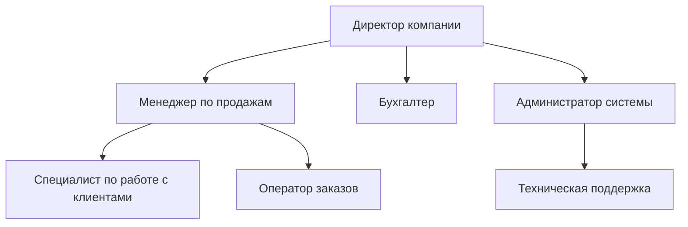
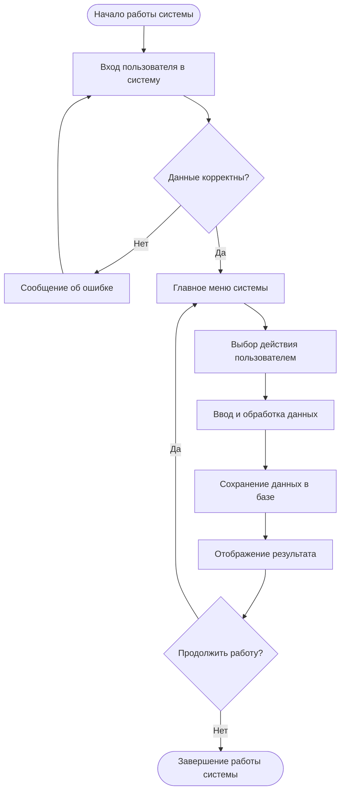

# **Лабораторная работа №1 – Анализ предметной области**

## **1. Теория**

### **1.1. Анализ предметной области**

**Предметная область** — это совокупность процессов, объектов и участников реальной деятельности, для которой разрабатывается программное обеспечение. Анализ предметной области позволяет понять, какие задачи выполняются в организации и каким образом они могут быть автоматизированы.

**Пример:**
Для интернет-магазина предметной областью является процесс онлайн-продаж товаров: оформление заказов, оплата, доставка и работа с клиентами.

Анализ предметной области является начальным этапом проектирования программного обеспечения и представляет собой процесс изучения реальной деятельности организации, для которой создаётся информационная система. Предметная область включает в себя совокупность объектов, процессов, правил, участников и информационных потоков, существующих в рамках конкретной сферы деятельности.

Цель анализа предметной области — получить полное и структурированное представление о том, **какие задачи решаются в организации, кем и каким образом**, а также определить, какие из этих задач целесообразно автоматизировать с помощью программного продукта.

### **1.2. Название компании**
Название компании определяет объект автоматизации и используется во всей проектной документации. Компания рассматривается как система с определёнными функциями, ресурсами и внутренними процессами.

**Пример:**
Компания «TechStore» — организация, занимающаяся розничной продажей электроники через интернет.

Указание названия компании позволяет определить объект автоматизации и зафиксировать контекст, в котором будет использоваться разрабатываемая система. Компания рассматривается как организационная структура, обладающая определёнными функциями, ресурсами и бизнес-процессами, требующими информационной поддержки.

### **1.3. Расширенное описание предметной области**

Расширенное описание предметной области включает детальную характеристику деятельности компании, её основных направлений работы и особенностей функционирования. В данном разделе рассматриваются:

* сфера деятельности организации;
* основные виды выполняемых операций;
* характер взаимодействия между сотрудниками и подразделениями;
* существующие проблемы и ограничения текущих процессов.

Данный этап анализа позволяет выявить ключевые процессы и определить области, в которых внедрение программного обеспечения повысит эффективность работы.

**Пример:**
Компания осуществляет приём заказов через сайт, обработку заказов менеджерами, хранение информации о клиентах и формирование отчётов о продажах. Основной проблемой является высокая нагрузка на менеджеров и ручная обработка данных.

### **1.4. Организационная структура компании**

Организационная структура компании отражает распределение обязанностей, ответственности и подчинённости между сотрудниками и подразделениями. Анализ структуры необходим для определения ролей пользователей будущей системы и их уровня доступа к информации и функциям.

Организационная структура, как правило, представляется в виде схемы, а функции сотрудников уточняются в табличной форме. Это позволяет установить связь между должностными обязанностями персонала и задачами, которые будут поддерживаться программным обеспечением.

Организационная структура показывает распределение обязанностей между сотрудниками и подразделениями. Она необходима для определения ролей пользователей системы.

**Пример:**

/// caption
Рисунок 1 - Пример организационной структуры компании
///

**Пояснение к схеме**

* **Директор компании** — осуществляет общее руководство и принимает управленческие решения.
* **Менеджер по продажам** — отвечает за обработку заказов и работу с клиентами.
* **Бухгалтер** — ведёт финансовый и налоговый учёт.
* **Администратор системы** — обеспечивает работу программного обеспечения и поддержку пользователей.
* **Специалисты и операторы** — выполняют операционные задачи.

### **1.5. Описание программного продукта**

Описание программного продукта формирует общее представление о системе, её назначении и области применения. В данном разделе определяется, для каких целей создаётся программное обеспечение и какие задачи оно должно решать.

#### **1.5.1. Название программного обеспечения**

Название программного обеспечения должно отражать его функциональное назначение и использоваться во всей проектной документации.

**Пример:**
«TechStore Management System».

#### **1.5.2. Вид программного обеспечения**

Вид программного обеспечения определяется по способу использования и архитектуре (например, веб-приложение, настольное приложение, информационная система). От выбора вида ПО зависят требования к реализации, эксплуатации и сопровождению системы.

Вид ПО определяется способом использования и архитектурой системы.

**Пример:**
Веб-приложение для управления интернет-магазином.

### **1.6. Основные пользователи системы**

**Пользователи системы** — это категории лиц, которые взаимодействуют с программным продуктом при выполнении своих профессиональных обязанностей. Для каждой категории пользователей определяются задачи, которые они решают с помощью системы.

Выделение пользователей позволяет:

* корректно сформировать функциональные требования;
* разграничить права доступа;
* спроектировать удобный пользовательский интерфейс.

**Пример:**

* администратор — управление пользователями и настройками;
* менеджер — обработка заказов;
* клиент — оформление и отслеживание заказов.
---

### **1.7. Ключевые процессы в программном обеспечении**

Ключевые процессы представляют собой основные виды деятельности, которые поддерживаются или автоматизируются системой. Они описывают последовательность действий, выполняемых пользователями, и ожидаемый результат выполнения.

Анализ процессов позволяет определить границы системы и обеспечить соответствие функционала реальным потребностям пользователей.

**Пример:**
Процесс «Оформление заказа» включает выбор товара клиентом, подтверждение заказа, обработку менеджером и передачу данных в бухгалтерию.

### **1.8. Требования к системе**

Требования к системе формируются на основе анализа предметной области и определяют, какими возможностями и характеристиками должно обладать программное обеспечение.

#### **1.8.1. Функциональные требования**

Функциональные требования описывают конкретные функции и операции, которые должна выполнять система, а также действия, доступные пользователям.

**Пример:**
Система должна обеспечивать создание, редактирование и просмотр заказов для менеджера.

#### **1.8.2. Нефункциональные требования**

Нефункциональные требования определяют качественные характеристики системы, такие как производительность, надёжность, безопасность, удобство использования и требования к эксплуатации.

Разделение требований на функциональные и нефункциональные обеспечивает структурированный и управляемый процесс разработки.

**Пример:**
Система должна обеспечивать время отклика не более 2 секунд при одновременной работе 50 пользователей.

### **1.9. Сценарий работы программного обеспечения**

Сценарий работы программного обеспечения описывает типовое взаимодействие пользоателя с системой при выполнении конкретной задачи. Сценарии позволяют наглядно представить работу системы с точки зрения пользователя и выявить возможные логические несоответствия.

**Пример:**
Пользователь заходит на сайт, выбирает товар, добавляет его в корзину, оформляет заказ и получает подтверждение по электронной почте.

### **1.10. Алгоритм работы системы**

Алгоритм работы системы отражает внутреннюю логику функционирования программного продукта и порядок обработки данных. Он описывает последовательность действий, условия переходов и возможные варианты выполнения операций.

Алгоритмы часто представляются в виде блок-схем, что упрощает понимание работы системы и служит основой для её реализации.

/// caption
Рисунок 2 - Пример алгоритма работы системы
///

**Пояснение к алгоритму**

* **Начало работы системы** — запуск программного продукта.
* **Вход пользователя** — аутентификация пользователя.
* **Проверка данных** — контроль логина и пароля.
* **Главное меню** — выбор доступных функций.
* **Обработка данных** — выполнение основных операций системы.
* **Сохранение данных** — запись результатов в базу данных.
* **Завершение работы** — выход пользователя из системы.

---

## **2. Задание**

###  **2.1. Описание задания**

**Раздел: Анализ предметной области**

В рамках выполнения данного задания студенту необходимо провести анализ предметной области и на его основе сформировать структурированное описание организации и разрабатываемого программного продукта.

#### **1. Название компании**

В данном пункте требуется указать наименование компании (реальной или условной), для которой разрабатывается программное обеспечение. Название компании определяет объект автоматизации и используется во всей дальнейшей документации.

#### **2. Расширенное описание предметной области**

Необходимо подробно описать сферу деятельности компании, её основные функции и особенности работы. В описании следует отразить:

* направление деятельности организации;
* основные выполняемые операции;
* проблемы и ограничения текущих процессов;
* причины необходимости внедрения программного продукта.

#### **3. Организационная структура компании**

Требуется описать организационную структуру компании, указав основные должности и подчинённость сотрудников.

* Организационная структура должна быть представлена в виде схемы (Рисунок 1).
* Дополнительно необходимо заполнить **Таблицу 1**, в которой описываются функции сотрудников: их должности и выполняемые обязанности.

#### **4. Описание программного продукта**

##### **4.1. Название программного обеспечения**

Указывается название разрабатываемого программного продукта.

##### **4.2. Вид программного обеспечения**

Необходимо определить вид ПО (например, веб-приложение, настольное приложение, информационная система и т.п.).

##### **4.3. Основные пользователи системы**

Следует определить категории пользователей системы и описать задачи, которые они решают с помощью программного обеспечения. Информация оформляется в **Таблице 2**.

#### **4.4. Ключевые процессы в программном обеспечении**

Необходимо выделить основные процессы, которые поддерживаются или автоматизируются системой. Для каждого процесса указывается:

* название процесса;
* краткое описание;
* участники процесса.

Данные оформляются в **Таблице 3**.

#### **4.5. Требования к системе**

##### 4.5.1. Функциональные требования

В **Таблице 4** необходимо перечислить функции, которые должна выполнять система, и указать, для какого пользователя они предназначены.

##### 4.5.2. Нефункциональные требования

В **Таблице 5** требуется описать качественные характеристики системы (производительность, надёжность, безопасность, удобство использования и др.) с указанием пользователей или условий эксплуатации.

#### **5. Сценарий работы программного обеспечения**

Необходимо описать типовой сценарий взаимодействия пользователя с системой — последовательность действий от начала работы до получения результата.

#### **6. Алгоритм работы системы**

Требуется описать общий алгоритм работы системы, отражающий логику обработки данных и выполнения основных операций. Алгоритм может быть представлен в текстовом виде и дополнен блок-схемой.

### **2.2. Для выполнения требуется:**
1) Шаблон, см. описание лабораторной.  
2) Вариант задания — связан с вами на семестр опубликован в ЛМС.  
3) Требования для оформления см. в ЛМС или раздел в документации  
4) Для выполнения использовать draw.io  

### **2.3. Запрет**
Использование ИИ для решения лабораторной работы.

---

## **3. Контрольные вопросы**

1. Что такое предметная область? 
2. Какие существуют проблемы в выбранной предметной области? 
3. Кто является пользователями системы? 
4. В чем разница между функциональными и нефункциональными требованиями? 
5. Какие инструменты можно использовать для документирования предметной области?

---

## **4. Чек-лист для самопроверки**

|Баллы | Критерии выполнения                                                                                                                                                                                                                                                                                                                                                                                                                                                                                                                                                                                                                                                                                            |
| ----: | ----------------------------------------------------------------------------------------------------------------------------------------------------------------------------------------------------------------------------------------------------------------------------------------------------------------------------------------------------------------------------------------------------------------------------------------------------------------------------------------------------------------------------------------------------------------------------------------------------------------------------------------------------------------------------------------------------------------------------------------------------------------------------------------------------------------------------------------------------------------------------------------------------------------------------------------------------------------------------------------------------------------------------------------- |
| **5** | Работа выполнена **полностью, самостоятельно и осмысленно**. Представлен глубокий анализ предметной области с аргументированным описанием деятельности компании и выявлением проблемных зон. Организационная структура детализирована и обоснована, схема и таблица функций сотрудников полностью согласованы. Описание программного продукта логично вытекает из анализа предметной области, корректно определён вид ПО. Пользователи системы описаны полно, их задачи чётко связаны с функциональными требованиями. Ключевые процессы отражают реальную бизнес-логику и корректно распределены по ролям. Функциональные и нефункциональные требования сформулированы корректно, без дублирования, с указанием пользователей и условий эксплуатации. Сценарий работы ПО подробный, отражает реальное взаимодействие пользователя с системой. Алгоритм работы системы представлен логично и наглядно (в том числе в виде блок-схемы). Работа оформлена аккуратно, структура выдержана, отсутствуют логические и терминологические ошибки. |
| **4** | Работа выполнена полностью и самостоятельно. Все разделы заполнены, однако анализ предметной области и процессов выполнен без углубления. Возможны незначительные упрощения в описании требований или сценариев работы.                                                                                                                                                                                                                                                                                                                                                                                                                                                                                                                                                                                                                                                                                                                                                                                                                   |
| **3** | Работа выполнена в целом корректно, но отдельные разделы раскрыты поверхностно. Допущены неточности в формулировках или неполное раскрытие требований и процессов.                                                                                                                                                                                                                                                                                                                                                                                                                                                                                                                                                                                                                                                                                                                                                                                                                                                                        |
| **2** | Работа выполнена частично. Отсутствуют или формально заполнены несколько ключевых разделов. Наблюдается слабая связь между предметной областью и описанием программного продукта.                                                                                                                                                                                                                                                                                                                                                                                                                                                                                                                                                                                                                                                                                                                                                                                                                                                         |
| **1** | Работа выполнена формально и фрагментарно. Большинство разделов заполнено шаблонно, без понимания сути анализа предметной области.                                                                                                                                                                                                                                                                                                                                                                                                                                                                                                                                                                                                                                                                                                                                                                                                                                                                                                        |
| **0** | **Работа скопирована, выполнена с помощью ИИ без переработки, либо не сдана.**                                                                                                                                                                                                                                                                                                                                                                                                                                                                                                                                                                                                                                                                                                                                                                                                                                                                                                                                                            |                                                                                                                                                                                                                                                                                                                                                                                                                                                            |

---

## **5. Ссылка на скачивание шаблона**

👉 [Скачать шаблон отчёта](assets/tempales//LR1.docx)