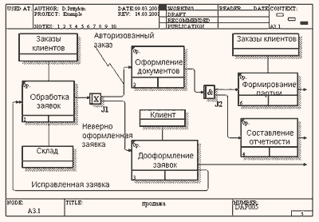

# Лабораторная работа №10 - Моделирование бизнес-процессов в нотации IDEF3

## **1.0. Цель работы**

Целью лабораторной работы является изучение и практическое освоение **моделирования бизнес-процессов в нотации IDEF3**, а также формирование навыков:

* описания сценариев выполнения бизнес-процессов;
* моделирования последовательности действий и событий;
* анализа альтернативных и параллельных потоков выполнения;
* документирования логики процессов в виде сценарных моделей;
* использования IDEF3 совместно с IDEF0, DFD и UML.

### **1.1. Общая роль сценарного моделирования бизнес-процессов**

Сценарное моделирование применяется для **описания того, как именно выполняется бизнес-процесс во времени**, с учётом последовательности действий, вариантов развития событий и условий переходов.

В отличие от функционального анализа (IDEF0) и анализа потоков данных (DFD), сценарные модели позволяют:

* зафиксировать **реальный порядок выполнения работ**;
* описать **варианты поведения процесса**;
* выявить точки принятия решений;
* формализовать бизнес-логику для последующей автоматизации.

Для этих целей используется нотация **IDEF3**.

### **1.2. Нотация IDEF3: общее представление**

**IDEF3 (Integrated DEFinition for Process Description Capture)** — это нотация, предназначенная для **описания сценариев выполнения процессов и переходов между действиями**.

IDEF3 отвечает на вопрос:

> **Как выполняется процесс шаг за шагом?**

IDEF3 используется для:

* фиксации бизнес-процессов «как есть» (AS-IS);
* проектирования процессов «как должно быть» (TO-BE);
* уточнения логики, скрытой за функциональными моделями;
* подготовки требований к автоматизации.

### **1.3. Основные элементы нотации IDEF3**

IDEF3 использует ограниченный, но строго определённый набор элементов.

#### **1.3.1. Единица поведения (UOB – Unit of Behavior)**

**UOB** — это элементарное действие или шаг процесса.

Характеристики UOB:

* изображается в виде прямоугольника;
* формулируется глагольной фразой
  (например: «Принять заявку», «Проверить данные», «Сформировать отчёт»);
* отражает **факт выполнения действия**, а не его внутреннюю реализацию.

#### **1.3.2. Связь предшествования (Precedence Link)**

Связь предшествования показывает, **в каком порядке выполняются действия**.

Особенности:

* изображается стрелкой;
* определяет последовательность выполнения UOB;
* может иметь условия или пояснения.

#### **1.3.3. Узлы разветвления и синхронизации (Junctions)**

Узлы используются для описания логики управления потоком выполнения.

Основные типы:

* **AND** — параллельное выполнение;
* **OR** — альтернативное выполнение (одна или несколько ветвей);
* **XOR** — выбор только одной ветви.

Узлы применяются как для **разделения**, так и для **объединения** потоков.

### **1.4. Диаграмма процесса IDEF3 (Process Flow Description)**

Диаграмма процесса IDEF3 отображает **последовательность выполнения действий** в рамках конкретного сценария.

Она позволяет:

* описать основной сценарий;
* показать альтернативные ветви;
* отразить параллельные действия;
* зафиксировать точки принятия решений.

#### **1.4.1. Пример диаграммы IDEF3 (основной сценарий)**

Рассмотрим процесс **обработки заявки**.

/// caption
Рисунок 1 – Диаграмма IDEF3: сценарий обработки заявки
///

### **1.6. Отличие IDEF3 от IDEF0, DFD и UML**

IDEF3 занимает особое место среди нотаций моделирования:

* **IDEF0** — отвечает на вопрос *«что делает система?»*;
* **DFD** — отвечает на вопрос *«какие данные и как обрабатываются?»*;
* **IDEF3** — отвечает на вопрос *«как выполняется процесс?»*;
* **UML** — описывает поведение, структуру и взаимодействие объектов.

IDEF3 часто используется **в связке** с IDEF0 и DFD:

* IDEF0 задаёт функции,
* DFD — данные,
* IDEF3 — сценарии выполнения.

### **1.7. Правила построения диаграмм IDEF3**

При построении диаграмм IDEF3 необходимо соблюдать следующие правила:

* каждая UOB должна быть логически завершённым действием;
* последовательность должна быть однозначно читаемой;
* узлы разветвления должны иметь чёткую семантику (AND / OR / XOR);
* диаграмма должна описывать **один сценарий или процесс**;
* названия действий должны быть краткими и однозначными.

### **1.8. Значение IDEF3 в проектировании информационных систем**

Использование IDEF3 позволяет:

* формализовать реальные сценарии работы;
* выявить скрытые ветвления и зависимости;
* подготовить требования к автоматизации процессов;
* повысить точность проектных решений;
* улучшить взаимодействие между аналитиками и разработчиками.

Нотация IDEF3 является важным инструментом анализа и проектирования бизнес-процессов и эффективно дополняет другие модели предметной области.

---

## **2. Задание**

### **2.0. Исходные данные (предметная область)**

Для выполнения лабораторной работы используется **информационная система по предметной области, закреплённой за студентом на семестр**.
Конкретный вариант предметной области и функциональных сценариев определяется индивидуальным заданием, опубликованным в **ЛМС**.

Предметная область должна быть согласована с ранее выполненными лабораторными работами, в том числе:

   * анализом предметной области;
   * моделированием бизнес-процессов в нотации IDEF0;
   * моделированием потоков данных в нотации DFD;
   * UML-диаграммами (варианты использования, деятельность, состояния).

### **2.1. Описание задания**

Необходимо выполнить **сценарное моделирование бизнес-процессов информационной системы** с использованием нотации **IDEF3**.

В рамках задания требуется:

1. Выбрать **один ключевой бизнес-процесс** предметной области
   (например: обработка заявки, оформление заказа, регистрация пользователя, расчёт показателей).
2. Определить **основной сценарий выполнения процесса**.
3. Построить **IDEF3-диаграмму процесса (Process Flow Description)**, отразив:

      * последовательность действий (UOB);
      * логические переходы между действиями;
      * альтернативные ветви выполнения;
      * параллельные действия (при наличии).

4. Использовать **узлы разветвления (AND / OR / XOR)** для описания логики управления потоком.
5. Обеспечить логическую согласованность IDEF3-диаграммы с ранее построенными моделями:

      * функциями IDEF0;
      * потоками данных DFD;
      * процессами UML Activity (при наличии).

Диаграмма должна описывать **реальный или проектируемый сценарий выполнения процесса** и быть однозначно интерпретируемой.

### **2.2. Для выполнения требуется**

1. **Шаблон отчёта**, указанный в описании лабораторной работы.
2. **Вариант задания**, закреплённый за студентом на семестр и опубликованный в ЛМС.
3. **Требования к оформлению** — согласно методическим указаниям в ЛМС или соответствующему разделу документации.
4. Для построения диаграмм использовать **draw.io (diagrams.net)**.

Все диаграммы должны быть:

* выполнены в нотации **IDEF3**;
* сохранены в виде изображений;
* вставлены в отчёт с подписями.

### **2.3. Запрет**

❗ **Запрещается использование систем искусственного интеллекта для выполнения лабораторной работы.**

Работы, выполненные с использованием ИИ, полностью или частично скопированные, а также не сданные, оцениваются в **0 баллов** без возможности доработки.

---

## **3. Контрольные вопросы**

1. Для чего используется моделирование бизнес-процессов в нотации IDEF3?
2. Чем IDEF3 отличается от IDEF0?
3. Что такое UOB (Unit of Behavior)?
4. Какую роль играют связи предшествования в IDEF3?
5. Для чего используются узлы AND, OR и XOR?
6. В каких случаях в процессе возникает параллельное выполнение действий?
7. Чем сценарное моделирование отличается от функционального?
8. Как IDEF3 связан с DFD и UML Activity Diagram?
9. Какие типичные ошибки допускаются при построении IDEF3-диаграмм?
10. Почему IDEF3 удобно использовать при проектировании автоматизации процессов?

---

## **4. Чек-лист для самопроверки**

|   Баллы | Критерии выполнения                                                                                                                                                                                                                 |
| : | -- |
|   **8** | Построена IDEF3-диаграмма; корректно выделены действия (UOB); логика последовательности, альтернатив и параллельных ветвей отражена корректно; диаграмма согласована с IDEF0 и DFD; оформление полностью соответствует требованиям. |
|   **5-7** | Диаграмма представлена, но имеются незначительные логические или методические неточности (частично не раскрыты условия переходов).                                                                                                  |
|   **3-4** | Диаграмма построена формально; сценарий описан поверхностно; допущены ошибки в использовании узлов AND/OR/XOR.                                                                                                                      |
| **1–2** | Диаграмма содержит существенные логические ошибки или не отражает реальный сценарий процесса.                                                                                                                                       |
|   **0** | **Работа скопирована, выполнена с помощью ИИ, либо не сдана.**                                                                                                                                                                      |

---

## **5. Ссылка на скачивание шаблона отчета**

👉 [Скачать шаблон отчёта](assets/tempales//LR10.docx)