# Лабораторная работа №3 - Построение архитектуры программного средства

## **1. Теория**

### **1.0. Цель работы**
Целью лабораторной работы является освоение принципов архитектурного проектирования программного средства с использованием модели C4, включая формирование контекстного, контейнерного и компонентного представлений системы, определение границ ответственности, способов взаимодействия компонентов и обоснование выбранных архитектурных решений.

### **1.1.  Понятие архитектуры программного средства**

**Архитектура программного средства (ПС)** — это совокупность структурных решений о компонентах системы, связях между ними, принципах организации, паттернах взаимодействия и ограничениях, определяющих её качество, расширяемость, эффективность и жизненный цикл.

Архитектура определяет:

* **Что** делает система (функциональные требования).
* **Как** она должна работать (нефункциональные требования: производительность, надёжность, безопасность, масштабируемость).
* **Какие элементы и модули** должны существовать в системе.
* **Каким образом** эти элементы взаимодействуют.

Архитектор фиксирует ключевые решения в виде:

* архитектурных стилей,
* диаграмм,
* ограничений,
* документированных компромиссов.

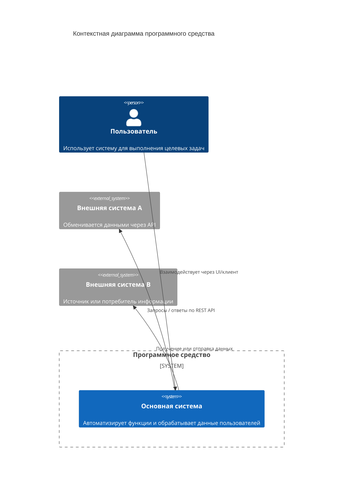
```mermaid
C4Context
title Контекстная диаграмма программного средства

Person(user, "Пользователь", "Использует систему для выполнения целевых задач")

System_Boundary(sys, "Программное средство") {
    System(system, "Основная система", "Автоматизирует функции и обрабатывает данные пользователей")
}

System_Ext(ext1, "Внешняя система A", "Обменивается данными через API")
System_Ext(ext2, "Внешняя система B", "Источник или потребитель информации")

Rel(user, system, "Взаимодействует через UI/клиент")
Rel(system, ext1, "Запросы / ответы по REST API")
Rel(system, ext2, "Получение или отправка данных")

```
/// caption
Диаграмма 1 - Контекстная архитектура ПС (C4 — Level 0)
///

### **1.2. Цели построения архитектуры**

Построение архитектуры направлено на:

1. **Удовлетворение требований** — создание структуры, способной обеспечить выполнение всех функциональных и нефункциональных требований.
2. **Управление сложностью** — разделение системы на управляемые компоненты.
3. **Повышение устойчивости системы (robustness)** — обеспечение отказоустойчивости и предсказуемости.
4. **Масштабируемость** — возможность развития ПС без полного переписывания.
5. **Минимизация рисков** — выявление архитектурных слабостей до начала разработки.
6. **Оптимизацию стоимости владения (TCO)** — снижение затрат на поддержку и развитие.

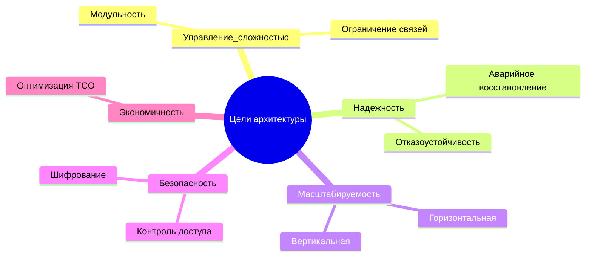
```mermaid
mindmap
  root((Цели архитектуры))
    Управление_сложностью
      Модульность
      Ограничение связей
    Надежность
      Отказоустойчивость
      Аварийное восстановление
    Масштабируемость
      Горизонтальная
      Вертикальная
    Безопасность
      Контроль доступа
      Шифрование
    Экономичность
      Оптимизация TCO
```

/// caption
Диаграмма 2 - Цели архитектуры (mindmap)
///


### **1.3. Компоненты архитектуры программного средства**

#### **1.3.1. Функциональная архитектура**

Определяет:

* основные функции и сценарии использования;
* модули, отвечающие за реализацию пользовательских требований;
* границы модулей (bounded contexts);
* основные потоки данных.

Используемые артефакты:

* диаграммы вариантов использования (Use Case);
* сценарии взаимодействия (Sequence);
* контекстная диаграмма.

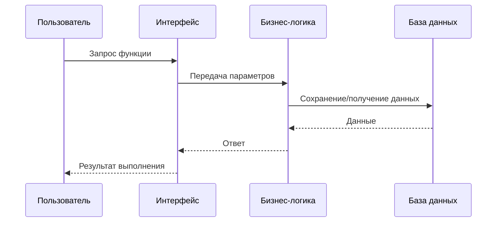
```mermaid
sequenceDiagram
    participant U as Пользователь
    participant UI as Интерфейс
    participant BL as Бизнес-логика
    participant DB as База данных

    U->>UI: Запрос функции
    UI->>BL: Передача параметров
    BL->>DB: Сохранение/получение данных
    DB-->>BL: Данные
    BL-->>UI: Ответ
    UI-->>U: Результат выполнения
```

/// caption
Диаграмма 3 - Диаграмма взаимодействия
///


#### **1.3.2. Логическая архитектура**

Описывает разбиение системы на подсистемы и их ответственность.

Типичные уровни:

* уровень представления (UI/UX);
* уровень бизнес-логики;
* уровень доступа к данным.

Логическая архитектура не привязана к конкретным технологиям — это модель сущностей и правил.

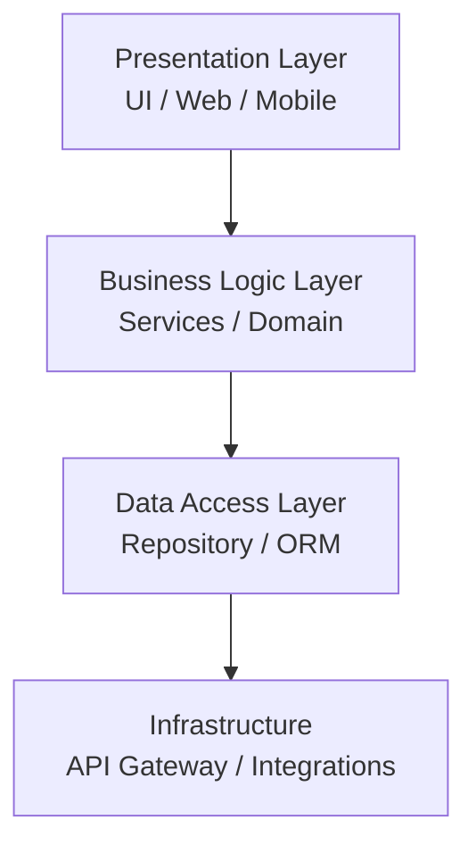
```mermaid
flowchart TB
    A[Presentation Layer<br>UI / Web / Mobile]
    B[Business Logic Layer<br>Services / Domain]
    C[Data Access Layer<br>Repository / ORM]
    D[Infrastructure<br>API Gateway / Integrations]

    A --> B
    B --> C
    C --> D
```

/// caption
Диаграмма 4 - Логическая архитектура
///


#### **1.3.3. Физическая архитектура**

Определяет размещение программных компонентов на:

* серверах,
* контейнерах,
* базах данных,
* сетевой инфраструктуре.

Для визуализации используются:

* диаграммы развёртывания (Deployment),
* схемы инфраструктуры.

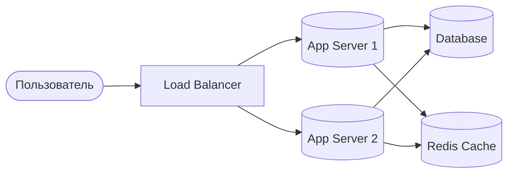
```mermaid
graph LR
    user([Пользователь])
    lb[Load Balancer]
    app1[(App Server 1)]
    app2[(App Server 2)]
    db[(Database)]
    cache[(Redis Cache)]

    user --> lb
    lb --> app1
    lb --> app2
    app1 --> db
    app2 --> db
    app1 --> cache
    app2 --> cache
```

/// caption
Диаграмма 5 - Физическая архитектура
///

#### **1.3.4. Архитектура данных**

Включает:

* модели данных;
* схемы БД;
* форматы хранения и передачи данных (JSON, XML, Protobuf);
* правила валидации;
* стратегии миграций.

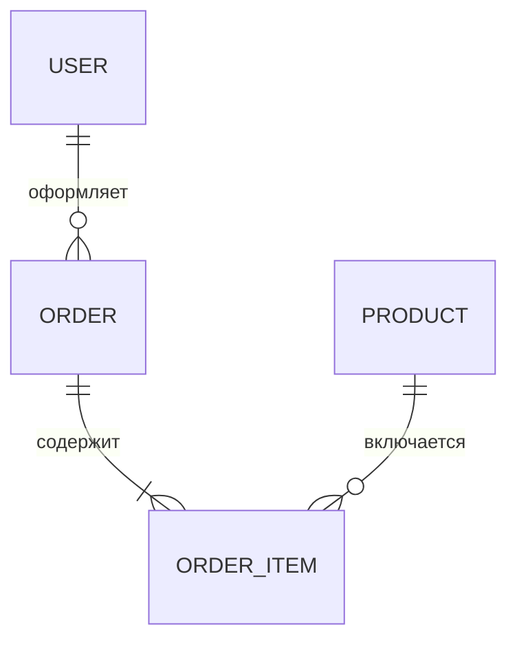
```mermaid
erDiagram
    USER ||--o{ ORDER : "оформляет"
    ORDER ||--|{ ORDER_ITEM : "содержит"
    PRODUCT ||--o{ ORDER_ITEM : "включается"


```

/// caption
Диаграмма 6 - Архитектура данных
///

---

#### **1.3.5. Интеграционная архитектура**

Описывает взаимодействие между компонентами и внешними системами.

Может включать:

* REST / gRPC API контракты,
* очереди сообщений (RabbitMQ, Kafka),
* события и подписчики (event-driven),
* адаптеры внешних сервисов.


#### **1.3.6. Архитектура безопасности**

Фиксирует:

* модели доступа (RBAC/ABAC),
* аутентификацию и авторизацию (OAuth2, JWT),
* протоколы шифрования (TLS),
* защиту данных и логирование.
 

#### **1.3.7. Архитектура эксплуатации (DevOps)**

Формирует требования и решения по:

* CI/CD pipeline,
* сборке и доставке артефактов,
* мониторингу и логированию,
* контейнеризации,
* оркестрации (Kubernetes, Docker Swarm).

 
### **1.4. Архитектурные стили**

#### **1.4.1. Монолитная архитектура**

Единый исполняемый модуль, содержащий все компоненты.

Преимущества:

* простота разработки;
* единое деплоивание.

Недостатки:

* сложность масштабирования;
* ограниченная гибкость.

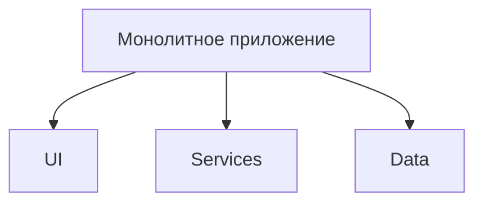
```mermaid
graph TB
    M[Монолитное приложение]
    M --> UI
    M --> Services
    M --> Data
```

/// caption
Диаграмма 7 - Монолитная архитектура
///


#### **1.4.2. Клиент-серверная архитектура**

Кунстный раздел между клиентской частью и серверной частью.

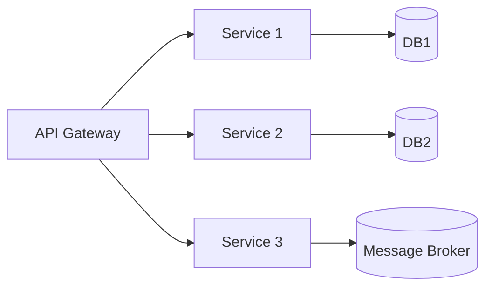
```mermaid
graph LR
    GW[API Gateway]
    S1[Service 1]
    S2[Service 2]
    S3[Service 3]
    DB1[(DB1)]
    DB2[(DB2)]
    MQ[(Message Broker)]

    GW --> S1
    GW --> S2
    GW --> S3
    S1 --> DB1
    S2 --> DB2
    S3 --> MQ
```

/// caption
Диаграмма 8 - Клиент-серверная архитектура
///

#### **1.4.3. Слоистая (Layered) архитектура**

Одна из самых распространённых моделей:

* Presentation Layer
* Business Logic Layer
* Data Access Layer
* Infrastructure Layer

Плюсы:

* чёткое разделение ответственности;
* управляемость модульностью.

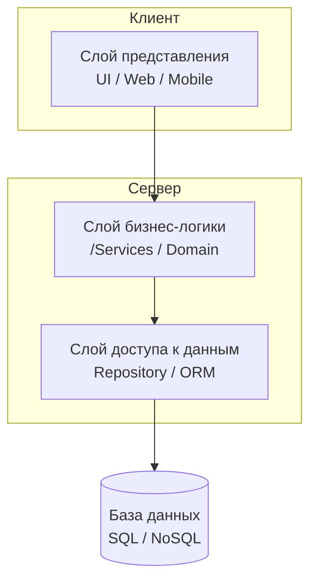
```mermaid
flowchart TB
    %% Слоистая архитектура приложения

    subgraph Клиент
        UI[Слой представления<br/>UI / Web / Mobile]
    end

    subgraph Сервер
        BL[Слой бизнес-логики<br>/Services / Domain]
        DAL[Слой доступа к данным<br/>Repository / ORM]
    end

    DB[(База данных<br/>SQL / NoSQL)]

    UI --> BL
    BL --> DAL
    DAL --> DB

```

/// caption
Диаграмма 9 - Слоистая (Layered) архитектура
///

#### **1.4.4. Микросервисная архитектура**

Система состоит из независимых сервисов.

Преимущества:

* гибкость;
* независимость команд;
* масштабирование отдельных частей.

Недостатки:

* сложность инфраструктуры;
* распределённые транзакции.

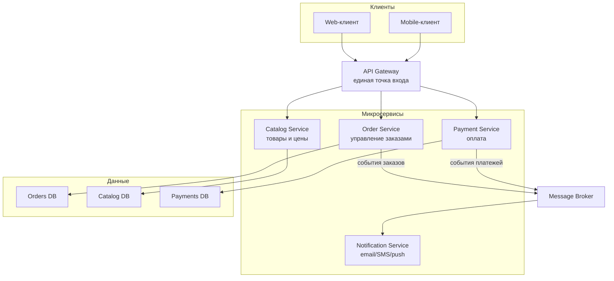
```mermaid
flowchart TB
    subgraph Клиенты
        Web[Web-клиент]
        Mobile[Mobile-клиент]
    end

    APIGW[API Gateway<br/>единая точка входа]

    subgraph Микросервисы
        OrderSvc[Order Service<br/>управление заказами]
        CatalogSvc[Catalog Service<br/>товары и цены]
        PaymentSvc[Payment Service<br/>оплата]
        NotificationSvc[Notification Service<br/>email/SMS/push]
    end

    subgraph Данные
        OrdersDB[Orders DB]
        CatalogDB[Catalog DB]
        PaymentsDB[Payments DB]
    end

    MQ[Message Broker]

    Web --> APIGW
    Mobile --> APIGW

    APIGW --> OrderSvc
    APIGW --> CatalogSvc
    APIGW --> PaymentSvc

    OrderSvc --> OrdersDB
    CatalogSvc --> CatalogDB
    PaymentSvc --> PaymentsDB

    OrderSvc -- "события заказов" --> MQ
    PaymentSvc -- "события платежей" --> MQ
    MQ --> NotificationSvc

```

/// caption
Диаграмма 10 - Микросервисная архитектура
///

#### **1.4.5. Service-Oriented Architecture (SOA)**

Сервисы связаны через шину (ESB), обеспечивающую централизованную интеграцию.


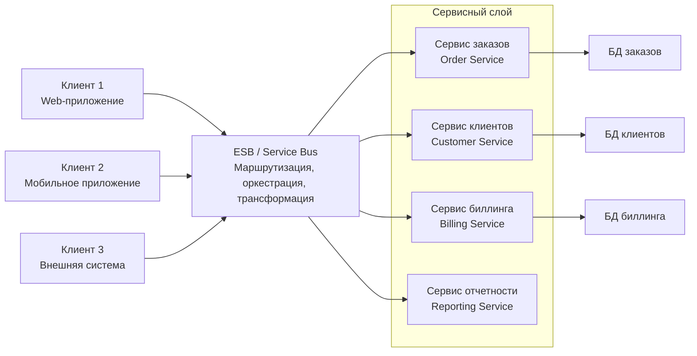
```mermaid
flowchart LR
    %% Клиенты
    Client1[Клиент 1<br/>Web-приложение]
    Client2[Клиент 2<br/>Мобильное приложение]
    Client3[Клиент 3<br/>Внешняя система]

    %% Шина сервисов
    ESB[ESB / Service Bus<br/>Маршрутизация, оркестрация, трансформация]

    %% Сервисы
    subgraph Services[Сервисный слой]
        S1[Сервис заказов<br/>Order Service]
        S2[Сервис клиентов<br/>Customer Service]
        S3[Сервис биллинга<br/>Billing Service]
        S4[Сервис отчетности<br/>Reporting Service]
    end

    %% Хранилища
    DB1[БД заказов]
    DB2[БД клиентов]
    DB3[БД биллинга]

    %% Клиенты -> ESB
    Client1 --> ESB
    Client2 --> ESB
    Client3 --> ESB

    %% ESB -> Сервисы
    ESB --> S1
    ESB --> S2
    ESB --> S3
    ESB --> S4

    %% Сервисы -> БД
    S1 --> DB1
    S2 --> DB2
    S3 --> DB3

```

/// caption
Диаграмма 11 - Service-Oriented Architecture
///

#### **1.4.6. Event-driven Architecture**

Система реагирует на события; используется pub/sub-модель.

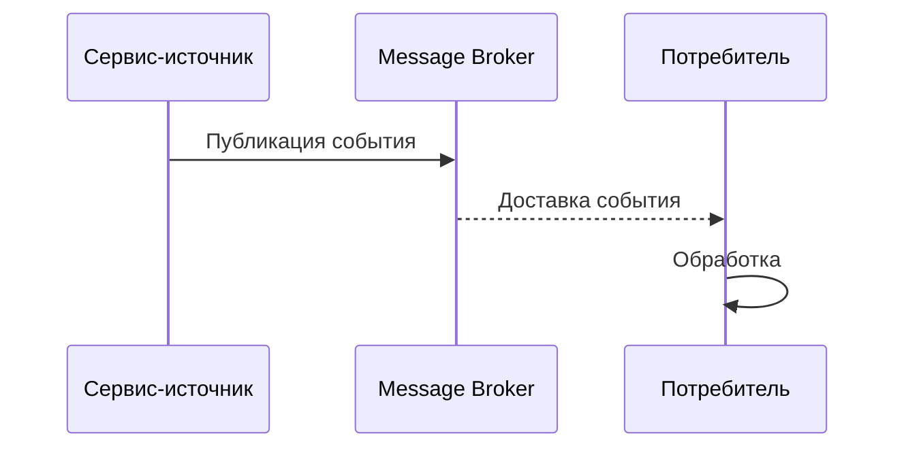
```mermaid
sequenceDiagram
    participant Producer as Сервис-источник
    participant Broker as Message Broker
    participant Consumer as Потребитель

    Producer->>Broker: Публикация события
    Broker-->>Consumer: Доставка события
    Consumer->>Consumer: Обработка
```

/// caption
Диаграмма 12 - Event-driven Architecture
///
 
### **1.5. Архитектурные паттерны**

1. **MVC / MVVM / MVP** — разделение представления, логики и моделей.
2. **Repository** — абстракция работы с данными.
3. **Factory / Singleton / Observer** — классические шаблоны ООП.
4. **Gateway / Adapter** — стандартизация доступа к внешним системам.
5. **CQRS** — разделение операций чтения и записи.
6. **Saga / Orchestration** — координация процессов в распределённых системах.


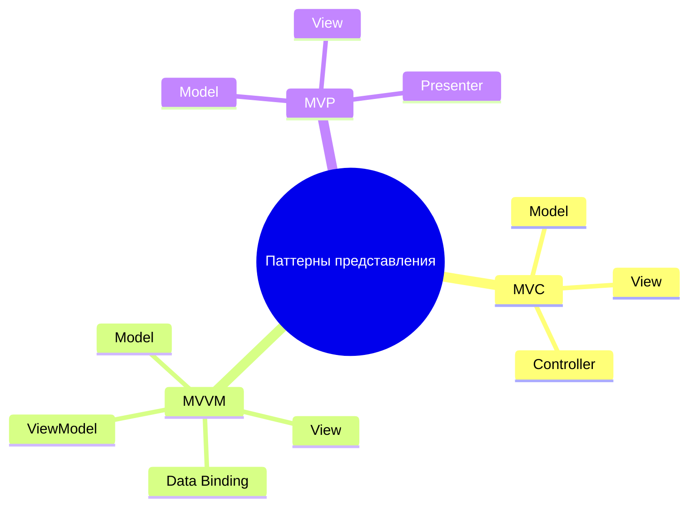
```mermaid
mindmap
  root((Паттерны представления))
    MVC
      Model
      View
      Controller
    MVVM
      Model
      View
      ViewModel
      Data Binding
    MVP
      Model
      View
      Presenter
```
/// caption
Диаграмма 13 - Архитектурные паттерны
///
 

### **1.6. Требования, влияющие на архитектуру**

#### **1.6.1. Функциональные требования**

Определяют архитектурные границы модулей и потоков данных.

#### **1.6.2. Нефункциональные требования**

Существенно влияют на выбор технологий.

Типы NFR:

* производительность (latency, throughput);
* масштабируемость;
* отказоустойчивость;
* безопасность;
* удобство поддержки (Maintainability);
* переносимость;
* модульность.

Архитектура должна обеспечивать выполнение NFR на уровне проектных решений.

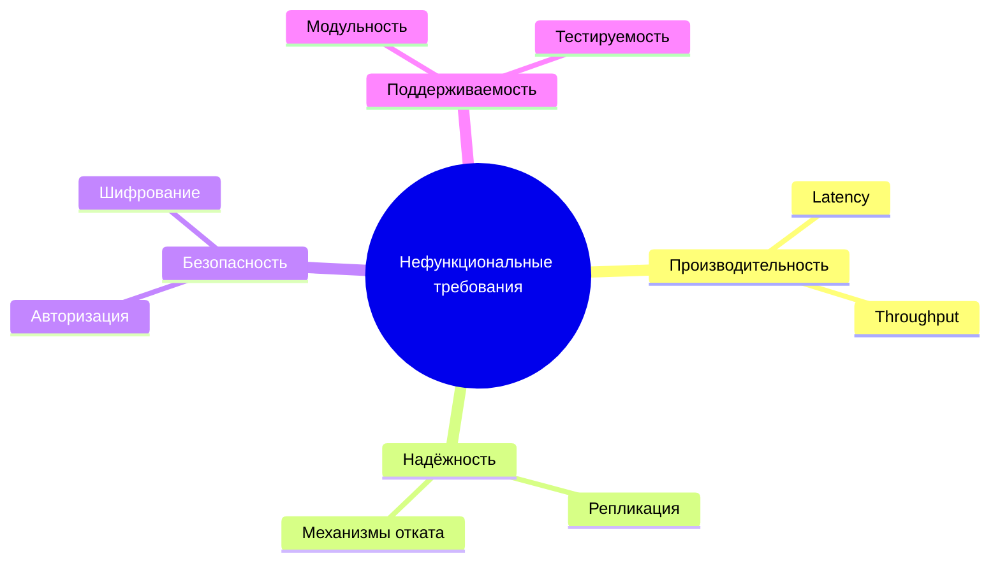
```mermaid
mindmap
  root((Нефункциональные требования))
    Производительность
      Latency
      Throughput
    Надёжность
      Репликация
      Механизмы отката
    Безопасность
      Авторизация
      Шифрование
    Поддерживаемость
      Модульность
      Тестируемость
```
/// caption
Диаграмма 14 - Нефункциональные требования
///

### **1.7. Технологические решения и ограничения**

При проектировании фиксируются:

1. Язык программирования.
2. Фреймворки.
3. Библиотеки.
4. Базы данных.
5. Инструменты DevOps.
6. Интеграционные протоколы.
7. Платформа развёртывания (cloud/on-premise).

Эти решения должны быть согласованы с требованиями, квалификацией команды и бюджетом.

 
## **1.8. Документирование архитектуры**

Архитектурная документация включает:

* **Диаграмму контекстов** — уровень С0 (C4 model).
* **Диаграмму контейнеров** — С1.
* **Диаграмму компонентов** — С2.
* **Диаграмму классов / модулей** — С3.
* **Диаграмму развёртывания**.
* **ADR (Architectural Decision Records)** — фиксация ключевых решений.
* **API-контракты**.
* **Руководство по архитектуре**.

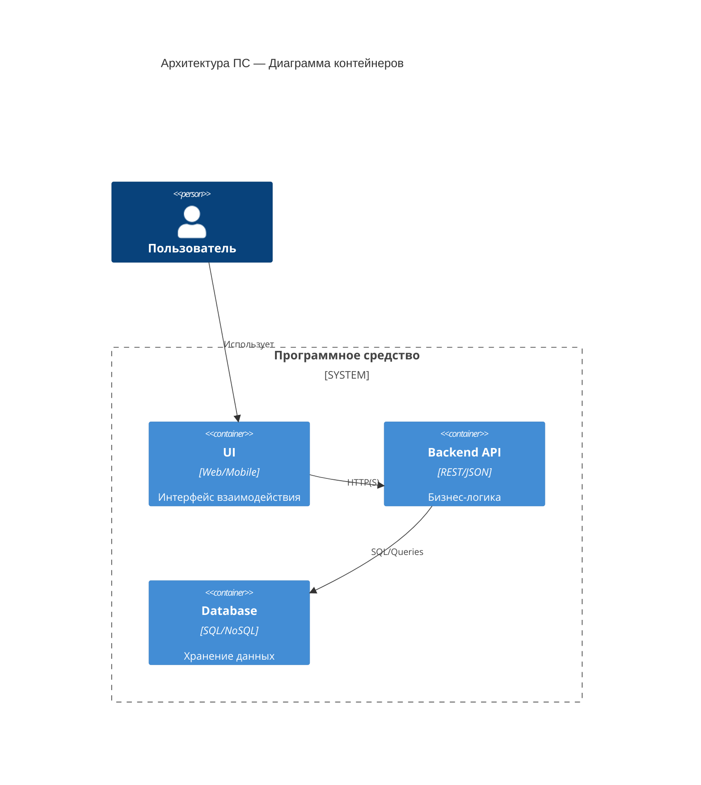
```mermaid
C4Container
title Архитектура ПС — Диаграмма контейнеров

Person(user, "Пользователь")

System_Boundary(s1, "Программное средство") {
    Container(ui, "UI", "Web/Mobile", "Интерфейс взаимодействия")
    Container(api, "Backend API", "REST/JSON", "Бизнес-логика")
    Container(db, "Database", "SQL/NoSQL", "Хранение данных")
}

Rel(user, ui, "Использует")
Rel(ui, api, "HTTP(S)")
Rel(api, db, "SQL/Queries")
```
/// caption
Диаграмма 15 - Документирование архитектуры
///

## **1.9. Процесс построения архитектуры**
Процесс включает восемь этапов, от анализа требований до архитектурного аудита.

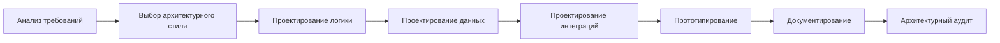
```mermaid
flowchart LR
    A[Анализ требований] --> B[Выбор архитектурного стиля]
    B --> C[Проектирование логики]
    C --> D[Проектирование данных]
    D --> E[Проектирование интеграций]
    E --> F[Прототипирование]
    F --> G[Документирование]
    G --> H[Архитектурный аудит]
```

/// caption
Диаграмма 16 - Процесс построения архитектуры
///

### Шаг 1. Анализ требований

Сбор FR и NFR, анализ рисков и ограничений.

### Шаг 2. Выбор архитектурного стиля

Монолит, слои, микросервисы, события и др.

### Шаг 3. Проектирование логической структуры

Определение подсистем, модулей, интерфейсов.

### Шаг 4. Проектирование данных

ER-диаграммы, схемы API, форматы.

### Шаг 5. Проектирование интеграций

Адаптеры, API, события.

### Шаг 6. Разработка прототипов (Proof of Concept)

Проверка выбранных технологий.

### Шаг 7. Документирование решений

Диаграммы, ADR.

### Шаг 8. Архитектурный аудит

Проверка выполнения NFR.


## **1.10. Ключевые качества хорошей архитектуры**

* **Простота и ясность**.
* **Минимальные зависимости**.
* **Высокая связанность внутри модулей, низкая связность между ними**.
* **Предсказуемость поведения**.
* **Гибкость изменений**.
* **Тестируемость**.
* **Документированность**.


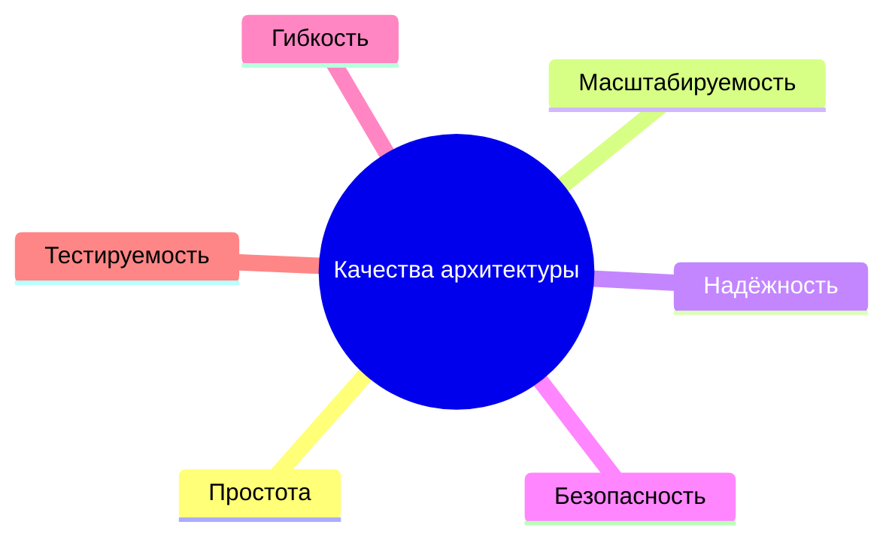
```mermaid
mindmap
  root((Качества архитектуры))
    Простота
    Масштабируемость
    Надёжность
    Безопасность
    Гибкость
    Тестируемость
```

/// caption
Диаграмма 17 - Ключевые качества хорошей архитектуры
///

## 1.11. Создание диаграммы C4

### 1.11.1. Общие сведения о C4 Model

**C4 Model** — это современный стандарт визуального описания архитектуры программного обеспечения, предложенный Саймоном Брауном.
Название C4 означает четыре уровня абстракции:

1. **Context (Контекст)** — кто взаимодействует с системой и в каком окружении она существует.
2. **Container (Контейнеры)** — крупные участки системы: приложения, API, БД, очереди сообщений.
3. **Component (Компоненты)** — внутренние части контейнеров: сервисы, модули, классы бизнес-логики.
4. **Code (Код/классы)** — отдельные классы и структуры (используется редко).

C4 позволяет:

* описывать архитектуру сверху вниз;
* фиксировать ответственность каждого элемента;
* показывать структурные связи;
* документировать систему независимо от конкретных технологий.


### 1.11.2. Что такое компонент в C4

**Компонент** в C4-модели — это логически обособленная часть контейнера, отвечающая за конкретный кусок функциональности.

Это **не класс** и не исходный файл, а **архитектурная единица**, объединяющая:

* ответственность (responsibility);
* функциональность (capability);
* интерфейсы (API/методы);
* взаимодействие с другими компонентами;
* зависимость от репозиториев, адаптеров, внешних сервисов и т. д.

**Примеры компонентов:**

* `OrderController`, `AuthController`;
* `PaymentService`, `NotificationService`;
* `UserRepository`, `ProductRepository`;
* `EncryptionProvider`;
* `ExternalCRMAdapter`;
* `EventPublisher`.

#### Основные элементы C4

##### Пользователи

Персоны и внешние акторы.

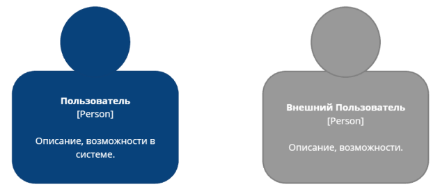
/// caption
Рисунок 1 – Пользователи
///

##### Связи

Штриховые линии с подписями.

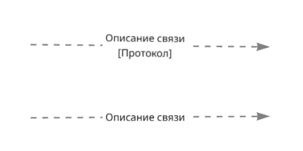
/// caption
Рисунок 2 – Связи
///

##### Программная система

Блок, отображающий разрабатываемое решение.

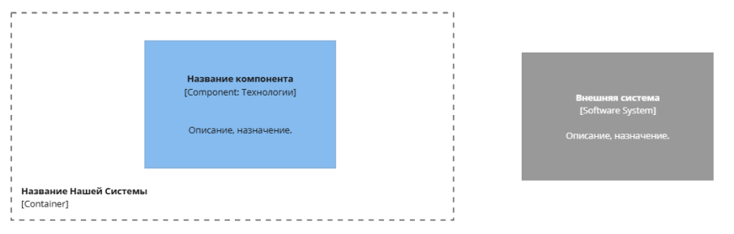
/// caption
Рисунок 3 – Программная система
///

##### Контейнер

Веб-приложение, API-сервер, БД, очередь сообщений, мобильное приложение.

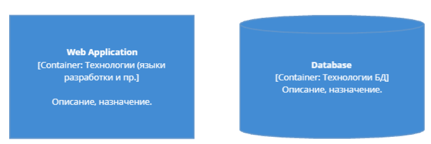
/// caption
Рисунок 4 – Контейнер
///
 

### 1.11.3. Основной принцип выделения компонентов

Компонент должен быть выделен, если:

1. **Он выполняет уникальную бизнес-роль.**
   Например: «Создать заказ», «Рассчитать тариф», «Проверить доступ».

2. **Он реализует отдельный технический функционал.**
   Например: работа с БД, логирование, кэширование.

3. **Он изменяется независимо от остального функционала.**
   Принцип «компонент — единица изменения».

4. **Он может быть повторно использован.**
   Например: единое правило валидации.

5. **У него чёткий API/интерфейс.**
   Контроллеры, сервисы, адаптеры.


### 1.11.4. Типы компонентов в архитектуре (C4 Component Tier)

Компоненты делятся по назначению.

#### 1.11.4.1. Контроллеры (Controllers)

Обрабатывают внешние запросы: HTTP, gRPC, WebSocket.
Примеры:

* `AuthController`;
* `OrderController`.

#### 1.11.4.2. Сервисы бизнес-логики (Business Services)

Содержат доменные правила.
Примеры:

* `OrderService`;
* `PricingService`;
* `InventoryService`.

#### 1.11.4.3. Репозитории (Repositories)

Инкапсулируют работу с данными.
Примеры:

* `UserRepository`;
* `ProductRepository`.

#### 1.11.4.4. Адаптеры внешних систем (Adapters / Gateways)

Обеспечивают связь с внешними API.
Примеры:

* `CRMAdapter`;
* `PaymentGatewayClient`.

#### 1.11.4.5. Провайдеры инфраструктуры (Providers)

Технические сервисы:

* `Logger`;
* `CacheProvider`;
* `EncryptionProvider`.

#### 1.11.4.6. Компоненты событий (Event Components)

* `EventPublisher`;
* `EventConsumer`;
* `EventHandler`.


### 1.11.5. Общая структура компонентного уровня C4

Типовой набор компонентов:

```text
Backend API Container
 ├─ Controllers
 │    ├─ OrderController
 │    ├─ AuthController
 │    └─ ReportController
 │
 ├─ Services
 │    ├─ OrderService
 │    ├─ PaymentService
 │    └─ NotificationService
 │
 ├─ Repositories
 │    ├─ UserRepository
 │    ├─ ProductRepository
 │    └─ OrderRepository
 │
 ├─ Adapters
 │    ├─ CRMAdapter
 │    └─ PaymentGateway
 │
 └─ Infrastructure
      ├─ LoggingProvider
      ├─ CacheProvider
      └─ EventPublisher
```


### 1.11.6. Примеры компонентных диаграмм C4

#### 1.11.6.1. Полноценная диаграмма компонентов (C4Component) — классический вариант (Controller → Service → Repository)

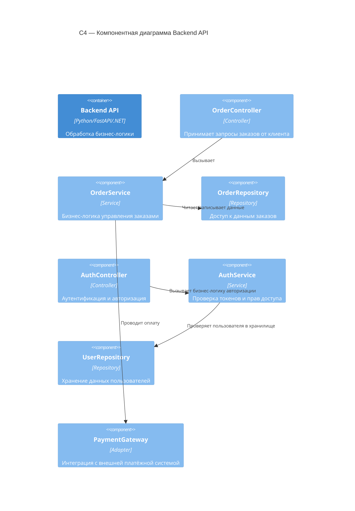
```mermaid
C4Component
title C4 — Компонентная диаграмма Backend API

Container(api, "Backend API", "Python/FastAPI/.NET", "Обработка бизнес-логики")

Component(controllerOrder, "OrderController", "Controller", "Принимает запросы заказов от клиента")
Component(serviceOrder, "OrderService", "Service", "Бизнес-логика управления заказами")
Component(repoOrder, "OrderRepository", "Repository", "Доступ к данным заказов")

Component(controllerAuth, "AuthController", "Controller", "Аутентификация и авторизация")
Component(serviceAuth, "AuthService", "Service", "Проверка токенов и прав доступа")
Component(userRepo, "UserRepository", "Repository", "Хранение данных пользователей")

Component(paymentAdapter, "PaymentGateway", "Adapter", "Интеграция с внешней платёжной системой")

Rel(controllerOrder, serviceOrder, "Вызывает")
Rel(serviceOrder, repoOrder, "Читает/записывает данные")
Rel(serviceOrder, paymentAdapter, "Проводит оплату")

Rel(controllerAuth, serviceAuth, "Вызывает бизнес-логику авторизации")
Rel(serviceAuth, userRepo, "Проверяет пользователя в хранилище")

```

/// caption
Диаграмма 19 - Полноценная диаграмма компонентов (C4Component)
///

#### 1.11.6.2. Микросервисный вариант компонентной диаграммы

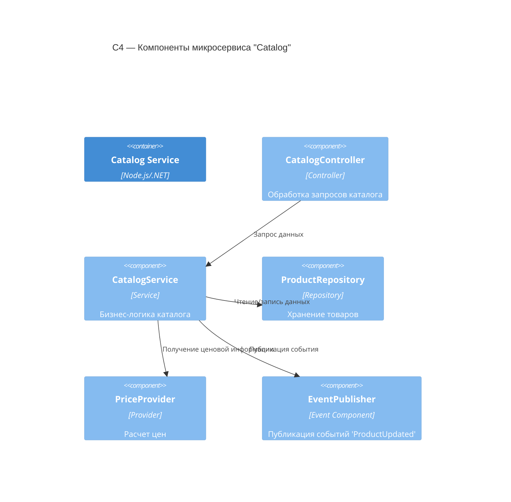
```mermaid
C4Component
title C4 — Компоненты микросервиса "Catalog"

Container(catalog, "Catalog Service", "Node.js/.NET")

Component(apiCtrl, "CatalogController", "Controller", "Обработка запросов каталога")
Component(catalogSvc, "CatalogService", "Service", "Бизнес-логика каталога")
Component(productRepo, "ProductRepository", "Repository", "Хранение товаров")
Component(priceProvider, "PriceProvider", "Provider", "Расчет цен")
Component(eventPub, "EventPublisher", "Event Component", "Публикация событий 'ProductUpdated'")

Rel(apiCtrl, catalogSvc, "Запрос данных")
Rel(catalogSvc, productRepo, "Чтение/запись данных")
Rel(catalogSvc, priceProvider, "Получение ценовой информации")
Rel(catalogSvc, eventPub, "Публикация события")
```

/// caption
Диаграмма 20 - Микросервисный вариант компонентной диаграммы
///

### 1.11.7. Отдельные визуализации типов компонентов

#### 1.11.7.1. Компоненты контроллеров

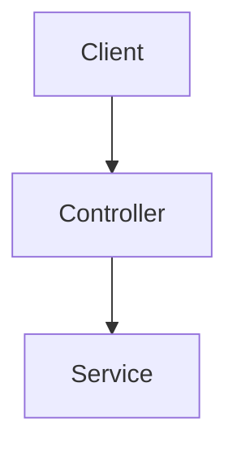
```mermaid
flowchart TD
    Client --> Controller
    Controller --> Service
```

/// caption
Диаграмма 21 - Компоненты контроллеров
///

#### 1.11.7.2. Компоненты сервисов бизнес-логики

```mermaid
flowchart TD
    Service --> Repo1
    Service --> Repo2
    Service --> Adapter
```

/// caption
Диаграмма 22 - Компоненты сервисов бизнес-логики
///


#### 1.11.7.3. Компоненты репозиториев

```mermaid
flowchart LR
    Repo --> DB[(Database)]
```

/// caption
Диаграмма 23 - Компоненты репозиториев
///

#### 1.11.7.4. Адаптеры внешних систем

```mermaid
flowchart LR
    Service --> Adapter --> ExternalAPI
```

/// caption
Диаграмма 24 - Адаптеры внешних систем
///

#### 1.11.7.5. Событийные компоненты

```mermaid
sequenceDiagram
    participant Service
    participant EventPublisher
    participant Queue

    Service->>EventPublisher: Создать событие
    EventPublisher->>Queue: Публикация
```

/// caption
Диаграмма 25 - Событийные компоненты
///

### 1.11.8. Методика разработки компонентных диаграмм C4

1. Определи **контейнер** (API, сервис, приложение, БД).
2. Выпиши **основные функции** контейнера.
3. Раздели их на **контроллеры**, **сервисы**, **репозитории**, **адаптеры**.
4. Определи связи: кто кого вызывает.
5. Проверь, что каждый компонент:

   * имеет одну ответственность (SRP);
   * изолирован;
   * использует чёткие интерфейсы.
6. Нарисуй диаграмму в стиле `C4Component`.


### 1.11.9. Уровни C4 с примерами и отдельными диаграммами

#### 1.11.9.1. Level 1 — Context Diagram

Диаграмма контекста показывает:

* систему как чёрный ящик;
* пользователей (акторов);
* внешние системы;
* основные взаимодействия.

**Пример контекстной диаграммы (C4Context):**

```mermaid
C4Context
title C4 — Диаграмма контекста

Person(user, "Пользователь", "Использует систему для выполнения операций")
System_Boundary(sys, "Информационная система") {
    System(app, "Основное приложение", "Предоставляет основной функционал")
}

System_Ext(ext1, "CRM", "Внешняя система управления клиентами")
System_Ext(ext2, "Платежный сервис", "Обрабатывает транзакции")

Rel(user, app, "Взаимодействует через интерфейс")
Rel(app, ext1, "Обменивается клиентскими данными")
Rel(app, ext2, "Запрашивает проведение платежей")
```

/// caption
Диаграмма 26 - Level 1 — Context Diagram
///

#### 1.11.9.2. Level 2 — Container Diagram

Контейнер — это **крупный исполняемый модуль**: web-приложение, мобильное приложение, API, база данных, брокер сообщений.
Контейнеры внутри системы взаимодействуют друг с другом и формируют архитектуру высокого уровня.

**Пример C4Container:**

```mermaid
C4Container
title C4 — Диаграмма контейнеров

Person(user, "Пользователь")

System_Boundary(sys, "Информационная система") {

    Container(ui, "Web UI", "React / Angular / Vue", "Предоставляет пользовательский интерфейс")
    Container(api, "Backend API", "Node.js / .NET / FastAPI", "Реализует бизнес-логику")
    Container(db, "Database", "PostgreSQL", "Хранит данные")
    ContainerQueue(mq, "Message Queue", "RabbitMQ", "Асинхронные события и интеграции")
}

Rel(user, ui, "Использует")
Rel(ui, api, "HTTP/HTTPS")
Rel(api, db, "SQL")
Rel(api, mq, "Публикует события")
Rel(mq, api, "Асинхронные уведомления")
```

/// caption
Диаграмма 27 - Level 2 — Container Diagram
///


#### 1.11.9.3. Level 3 — Component Diagram

Компоненты описывают, **из чего состоит контейнер**.
Обычно строят для Backend API или другого сложного контейнера.

**Пример компонентной диаграммы Backend API:**

```mermaid
C4Component
title C4 — Компоненты Backend API

Container(api, "Backend API", "Python/FastAPI/.NET")

Component(controller, "OrderController", "HTTP Controller", "Обрабатывает входящие запросы заказов")
Component(service, "OrderService", "Бизнес-логика", "Управляет логикой создания и обновления заказов")
Component(repo, "OrderRepository", "Repository", "Работа с данными заказов в БД")

Rel(controller, service, "Вызывает методы")
Rel(service, repo, "Читает/записывает данные")
```

/// caption
Диаграмма 28 - Level 3 — Component Diagram
///

#### 1.11.9.4. Level 4 — Code Diagram (Class Diagram)

Используется только при глубокой детализации.
Пример — класс доменной модели `Order`.

```mermaid
classDiagram
    class Order {
        +int id
        +datetime createdAt
        +float total
        +addItem()
        +calculateTotal()
    }

    class OrderItem {
        +int id
        +string productName
        +float price
    }

    Order --> OrderItem
```

/// caption
Диаграмма 29 - Level 4 — Code Diagram (Class Diagram)
///

### 1.11.10. Отдельная отрисовка каждого элемента C4

Ниже — примеры детализации каждого элемента модели C4.

#### 1.11.10.1. Отдельная диаграмма: Web UI

```mermaid
flowchart TB
    UI[Web UI<br/>React/Vue] --> Router[Маршрутизация]
    Router --> Pages[Страницы/Views]
    Pages --> APIClient[API Client<br/>Axios/Fetch]
```

/// caption
Диаграмма 30 - Отдельная отрисовка каждого элемента C4
///

#### 1.11.10.2. Отдельная диаграмма: Backend API

```mermaid
flowchart TD
    Controller[Controllers] --> Service[Сервисы бизнес-логики]
    Service --> Repository[Репозитории]
    Repository --> DB[(Database)]
```

/// caption
Диаграмма 31 - Отдельная диаграмма: Backend API
///

#### 1.11.10.3. Отдельная диаграмма: База данных

```mermaid
erDiagram
    USER ||--o{ ORDER : "оформляет"
    ORDER ||--|{ ORDER_ITEM : "содержит"
    PRODUCT ||--o{ ORDER_ITEM : "включается"
```

/// caption
Диаграмма 32 - Отдельная диаграмма: База данных
///

### 1.11.10. Дополнительные рекомендации по построению диаграмм C4

1. Определи **окружение системы**:
   кто пользователи, какие внешние системы.

2. Определи **крупные контейнеры**:
   база данных, API, фронтенд, сервисы, брокер сообщений.

3. Для каждого контейнера выдели **компоненты**:
   сервисы, репозитории, контроллеры, адаптеры.

4. При необходимости проработай **уровень кода (классы)**.

5. Используй **единый стиль и нотацию**:
   названия, описания, формулировки связей.

---

## **2. Задание**

### **2.0. Исходные данные (предметная область)**
Для выполнения лабораторной работы используется информационная система по предметной области, закреплённой за студентом на семестр.
Конкретный вариант предметной области и функциональных сценариев определяется индивидуальным заданием, опубликованным в ЛМС.
Предметная область должна быть согласована с ранее выполненными лабораторными работами. 

###  **2.1. Описание задания**
1. Проанализировать предметную область разрабатываемой информационной системы.
2. Определить пользователей (акторов), внешние системы и контекст функционирования.
3. Сформировать архитектурное видение системы в виде набора диаграмм C4.
4. Построить диаграммы уровней:

   * **C4 Level 1 — Context Diagram**
   * **C4 Level 2 — Container Diagram**
   * **C4 Level 3 — Component Diagram**
   * (опционально) **C4 Level 4 — Code Diagram**
5. Описать обнаруженные компоненты: контроллеры, сервисы, репозитории, адаптеры.
6. Оформить архитектурный документ с построенными диаграммами.


### **2.2. Порядок выполнения работы**

#### **Шаг 1. Анализ контекста и определение акторов**

Определить:

* кто взаимодействует с системой (пользователи, администраторы, внешние системы);
* основные сценарии использования.

**Результат:** диаграмма **C4 Context**.

#### **Шаг 2. Определение контейнеров системы**

Определить крупные блоки архитектуры:

* Web-интерфейс
* Backend API
* База данных
* Очередь сообщений
* Внешние интеграции

**Результат:** диаграмма **C4 Container**.

#### **Шаг 3. Выделение и описание архитектурных компонентов**

На основе структуры контейнеров:

* выделить контроллеры;
* выделить сервисы бизнес-логики;
* определить репозитории;
* определить адаптеры внешних систем;
* описать события (если система событийная).

**Результат:** текстовое описание компонентов.

#### **Шаг 4. Построение диаграммы компонентов**

Для выбранного контейнера (обычно Backend API):

* построить диаграмму **C4 Component**,
* показать связи между компонентами (Controller → Service → Repository).

Если проект микросервисный — построить компонентные диаграммы для каждого сервиса.

#### **Шаг 5. (Опционально) Диаграмма уровня кода**

Построить **C4 Code Diagram** для ключевой сущности (например, Order или User).

#### **Шаг 6. Формирование архитектурного документа**

Финальный отчёт должен содержать:

1. Описание системы.

2. Диаграммы:

   * Context
   * Container
   * Component
   * (опционально) Code

3. Текстовые описания акторов, контейнеров и компонентов.

4. Пример сценария взаимодействия (Sequence Diagram или текстовый сценарий).


### **2.3. Для выполнения требуется**

1. **Шаблон отчёта**, указанный в описании лабораторной работы.
2. **Вариант задания**, закреплённый за студентом на семестр и опубликованный в ЛМС.
3. **Требования к оформлению** — согласно методическим указаниям в ЛМС или соответствующему разделу документации.
4. Для построения диаграмм использовать **draw.io (diagrams.net)**.

Все диаграммы должны быть сохранены и вставлены в отчёт в виде изображений с подписями.


### **2.4. Запрет**

❗ **Запрещается использование систем искусственного интеллекта для выполнения лабораторной работы.**

Работы, выполненные с использованием ИИ, полностью или частично скопированные, а также не сданные, оцениваются в **0 баллов** без возможности доработки.

---

## **3. Контрольные вопросы**

1. Что такое модель C4 и для чего она используется?
2. Чем отличается контейнер от компонента?
3. Какие типы компонентов выделяют в архитектуре?
4. Что показывает диаграмма контекста?
5. Как описывается бизнес-логика на уровне компонентной диаграммы?
6. Какие преимущества даёт документирование архитектуры C4?

## **4. Чек-лист для самопроверки**

| Баллы   | Критерий                                                                                                                         |
| ------- | -------------------------------------------------------------------------------------------------------------------------------- |
| **5**   | Построены все уровни C4 (1–3), компоненты выделены корректно, связи описаны, модели согласованы, отчёт оформлен профессионально. |
| **4**   | Построены ≥2 уровня диаграмм, компоненты описаны частично, есть мелкие ошибки.                                                   |
| **3**   | Построен один уровень диаграммы, компоненты выделены неполно, много ошибок.                                                      |
| **1–2** | Работа выполнена поверхностно, диаграммы отсутствуют или некорректны.                                                            |
| **0**   | **Работа скопирована, выполнена с помощью ИИ, либо не сдана.**                                                               |


---

## **5. Ссылка на скачивание шаблона отчета**

👉 [Скачать шаблон отчёта](assets/tempales//LR3.docx)


