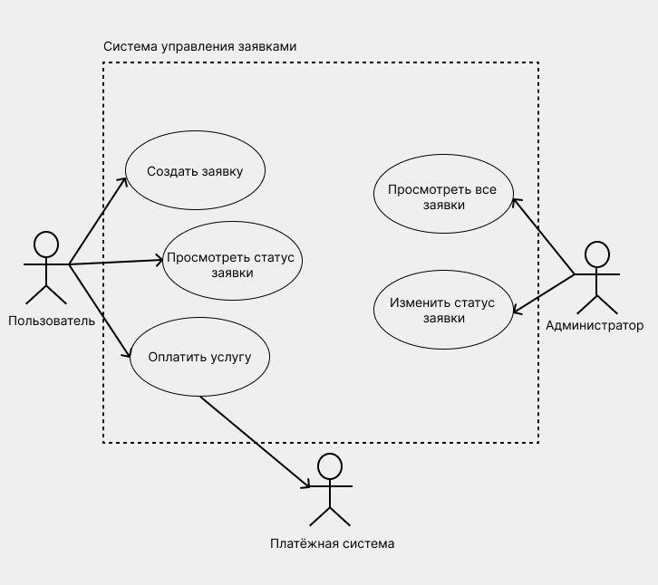
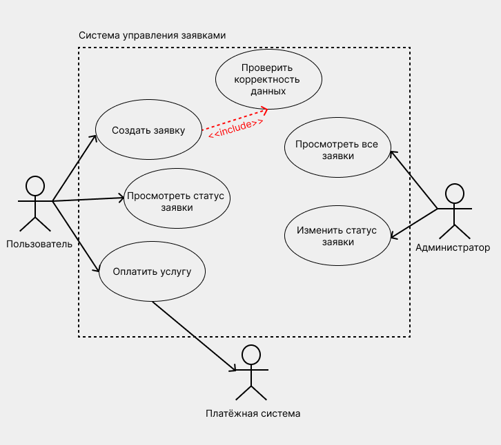
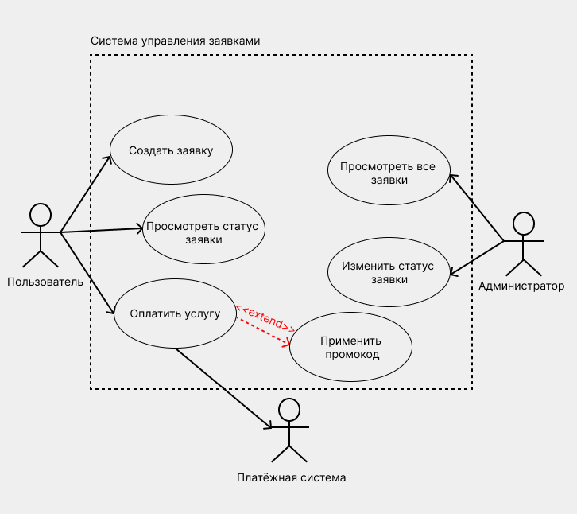
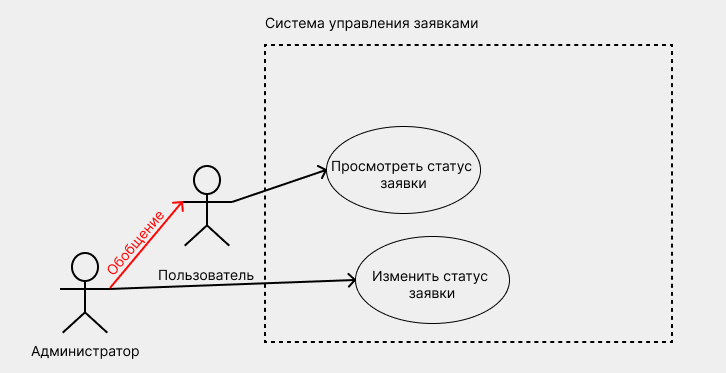
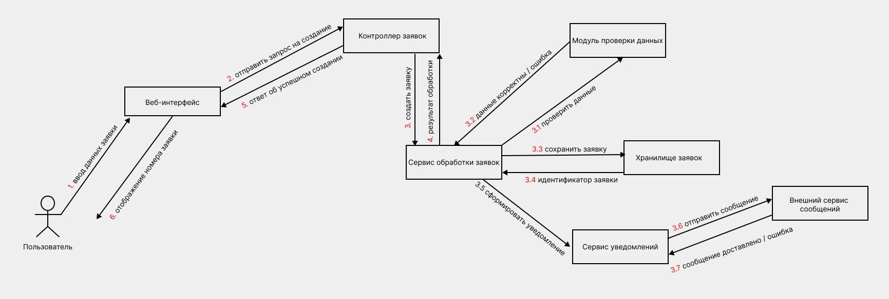

# Лабораторная работа №4 - Создание диаграммы вариантов использования и кооперации

## **1. Теория**

### **1.0. Цель работы**
Закрепить навыки анализа функциональных требований, а также освоить построение UML-диаграмм вариантов использования и диаграмм кооперации для моделирования поведения информационной системы.

### **1.1. Общая роль UML-диаграмм в проектировании информационных систем**

**UML (Unified Modeling Language)** — это унифицированный язык визуального моделирования, применяемый для описания, анализа, проектирования и документирования программных и информационных систем.

UML-диаграммы позволяют:

* формализовать требования заказчика;
* снизить неоднозначность трактовки функциональности;
* обеспечить единое понимание системы между аналитиками, разработчиками и заказчиком;
* служить основой для архитектурных и проектных решений.

Диаграммы вариантов использования и диаграммы кооперации относятся к **поведенческим диаграммам UML**, так как описывают поведение системы и взаимодействие её элементов.

### **1.2. Диаграмма вариантов использования (Use Case Diagram)**

Рассмотрим абстрактную **информационную систему управления заявками (Service System)**.

Акторы:

* Пользователь
* Администратор
* Внешняя платёжная система

Основные функции:

* создание заявки;
* просмотр статуса;
* оплата услуги;
* администрирование заявок.

#### **1.2.1. Назначение диаграммы вариантов использования**

Диаграмма вариантов использования предназначена для **описания функциональных требований к системе с точки зрения пользователя или внешних систем**.

Она отвечает на вопросы:

* какие функции предоставляет система;
* кто может пользоваться этими функциями;
* при каких условиях выполняются сценарии.

Use Case Diagram отражает **внешний взгляд на систему**, не затрагивая детали реализации, архитектуры и внутренней логики.

#### **1.2.2. Основные элементы диаграммы вариантов использования**

##### **Актор (Actor)**

**Актор** — это внешняя по отношению к системе сущность, взаимодействующая с ней.

В роли актора могут выступать:

* пользователь (клиент, администратор, оператор);
* внешняя информационная система;
* аппаратное устройство;
* сервис или API.

Актор не является частью системы, он только инициирует или получает результат её работы.

##### Вариант использования (Use Case)

**Вариант использования** — это законченный сценарий взаимодействия актора с системой, направленный на достижение конкретной цели.

Характерные особенности:

* описывает *что* делает система, а не *как*;
* формулируется глаголом в неопределённой форме (например: «Оформить заказ», «Просмотреть отчёт»);
* имеет практическую ценность для пользователя.

##### **Граница системы (System Boundary)**

Граница системы определяет:

* какие функции входят в состав разрабатываемой системы;
* какие взаимодействия считаются внешними.

Все варианты использования располагаются **внутри границы**, акторы — **за её пределами**.

#### **1.2.3. Типы связей на диаграмме вариантов использования**

##### **Ассоциация (Association)**

Показывает факт взаимодействия актора с вариантом использования.
Обозначается сплошной линией.

/// caption
Рисунок 1 – Ассоцияция
///

Пояснение:

* акторы расположены вне границы системы;
* все варианты использования находятся внутри системы;
* диаграмма отражает **только функциональные требования**, без деталей реализации.

##### Включение (include)

Используется, когда один вариант использования **всегда** включает выполнение другого.

Назначение:

* устранение дублирования;
* повторное использование общего функционала.

/// caption
Рисунок 2 – Включение
///

Пояснение:

* проверка данных выполняется **всегда** при создании заявки;
* логика проверки вынесена в отдельный вариант использования.

##### Расширение (extend)

Используется для описания **дополнительного, условного поведения**, которое выполняется не всегда.

/// caption
Рисунок 3 – Расширение
///

Пояснение:

* применение промокода выполняется **опционально**;
* основной сценарий не зависит от дополнительного.

##### Обобщение (Generalization)

Применяется для:

* иерархий акторов;
* обобщённых вариантов использования.

Позволяет показать наследование поведения.

/// caption
Рисунок 4 – Обобщение
///

Пояснение:

* администратор наследует возможности обычного пользователя;
* обобщение упрощает диаграмму и исключает дублирование связей.

#### **1.2.4. Практическое значение диаграммы вариантов использования**

Диаграмма вариантов использования:

* служит отправной точкой для разработки технического задания;
* помогает выявить неполные или противоречивые требования;
* используется как основа для тест-кейсов и пользовательских сценариев;
* упрощает коммуникацию с заказчиком.

### **1.3. Диаграмма кооперации (Collaboration / Communication Diagram)**

#### **1.3.1. Назначение диаграммы кооперации**

Диаграмма кооперации предназначена для **описания взаимодействия объектов системы при выполнении конкретного сценария**.

Она показывает:

* какие объекты участвуют в процессе;
* какие сообщения передаются между ними;
* в каком порядке происходит взаимодействие.

В отличие от диаграммы вариантов использования, диаграмма кооперации отражает **внутреннюю логику выполнения сценария**.

#### **1.3.2. Место диаграммы кооперации в проектировании**

Диаграмма кооперации используется:

* после формирования вариантов использования;
* при проектировании архитектуры и классов;
* для анализа распределения ответственности между компонентами.

Она часто применяется как альтернатива диаграмме последовательности, но делает акцент не на временной шкале, а на структуре связей между объектами.

#### **1.3.3. Основные элементы диаграммы кооперации**

##### **Объект**

**Объект** — это экземпляр класса, участвующий во взаимодействии.

Обычно объекты представляют:

* контроллеры;
* сервисы;
* репозитории;
* пользовательский интерфейс;
* внешние сервисы.

##### **Связь (Link)**

Связь отражает возможность обмена сообщениями между объектами.

##### **Сообщение (Message)**

Сообщение обозначает:

* вызов метода;
* передачу данных;
* событие.

Сообщения нумеруются (1, 1.1, 1.2 и т.д.), что позволяет определить порядок выполнения операций.

#### **1.3.4. Особенности нотации диаграммы кооперации**

* порядок выполнения задаётся **нумерацией сообщений**, а не вертикальной осью времени;
* диаграмма компактнее и удобнее для анализа архитектурных связей;
* хорошо подходит для отображения сервисно-ориентированных и многослойных архитектур.

/// caption
Рисунок 5 – Диаграмма кооперации
///

### **1.4. Связь диаграмм вариантов использования и кооперации**

Диаграммы вариантов использования и кооперации применяются **совместно**:

* диаграмма вариантов использования отвечает на вопрос
  **«Что должна делать система?»**;
* диаграмма кооперации отвечает на вопрос
  **«Как объекты системы взаимодействуют при выполнении этой функции?»**.

Типовой порядок работы:

1. Формируются акторы и варианты использования.
2. Для каждого ключевого варианта использования выбирается сценарий.
3. Для сценария строится диаграмма кооперации.
4. На основе диаграмм уточняются классы, интерфейсы и архитектура.

### **1.5. Значение диаграмм в учебных и практических проектах**

Использование диаграмм вариантов использования и кооперации:

* формирует системное мышление;
* обучает декомпозиции требований;
* облегчает переход от анализа к проектированию;
* соответствует требованиям ГОСТ 34 и современным методологиям разработки ПО;
* является обязательным элементом проектной документации в учебных и реальных ИС.

---

## **2. Задание**

### **2.0. Исходные данные (предметная область)**
Для выполнения лабораторной работы используется информационная система по предметной области, закреплённой за студентом на семестр.
Конкретный вариант предметной области и функциональных сценариев определяется индивидуальным заданием, опубликованным в ЛМС.
Предметная область должна быть согласована с ранее выполненными лабораторными работами. 

###  **2.1. Описание задания**
#### **2.1.1. Диаграмма вариантов использования**

##### Требования к выполнению

1. Построить диаграмму вариантов использования (Use Case Diagram).
2. Определить не менее **4 вариантов использования**.
3. Указать всех акторов и их взаимодействие с системой.
4. Использовать:

   * минимум **одну связь include**;
   * минимум **одну связь extend**;
   * при необходимости — **обобщение акторов**.

##### Ожидаемые варианты использования (примерный перечень)

* Создать заявку
* Просмотреть статус заявки
* Обработать заявку
* Изменить статус заявки
* Отправить уведомление

> Допускается добавление собственных вариантов использования при обосновании.

#### **2.1.2. Диаграмма кооперации**

##### Требования к выполнению

1. Выбрать **один вариант использования** из задания 1 (рекомендуется: *«Создать заявку»* или *«Обработать заявку»*).
2. Построить диаграмму кооперации (Collaboration / Communication Diagram), отражающую внутренний сценарий выполнения выбранного варианта использования.
3. Определить не менее **4 объектов**, участвующих во взаимодействии.
4. Отразить:

   * последовательность сообщений;
   * взаимодействие с внешним сервисом (если применимо).
5. Использовать **нумерацию сообщений**.

#### **2.1.3. Аналитическое пояснение (обязательно)**

В отчёте описать:

1. Почему были выбраны именно эти акторы.
2. Логику выделения вариантов использования.
3. Роль каждого объекта на диаграмме кооперации.
4. Как диаграммы помогают понять архитектуру системы.

### **2.2. Для выполнения требуется**

1. **Шаблон отчёта**, указанный в описании лабораторной работы.
2. **Вариант задания**, закреплённый за студентом на семестр и опубликованный в ЛМС.
3. **Требования к оформлению** — согласно методическим указаниям в ЛМС или соответствующему разделу документации.
4. Для построения диаграмм использовать **draw.io (diagrams.net)**.

Все диаграммы должны быть сохранены и вставлены в отчёт в виде изображений с подписями.

### **2.3. Запрет**

❗ **Запрещается использование систем искусственного интеллекта для выполнения лабораторной работы.**

Работы, выполненные с использованием ИИ, полностью или частично скопированные, а также не сданные, оцениваются в **0 баллов** без возможности доработки.

---

## **3. Контрольные вопросы**
1. В чём заключается основное назначение диаграммы вариантов использования?
2. Что такое актор и чем он отличается от пользователя системы?
3. Какие элементы обязательно присутствуют на диаграмме вариантов использования?
4. В каких случаях используется связь include и чем она отличается от extend?
5. Что обозначает граница системы на диаграмме вариантов использования?
6. Для каких целей применяется диаграмма кооперации?
7. Какие элементы включает диаграмма кооперации?
8. Как задаётся порядок выполнения операций на диаграмме кооперации?
9. В чём принципиальное отличие диаграммы кооперации от диаграммы последовательности?
10. Как диаграммы вариантов использования и кооперации дополняют друг друга при проектировании ИС?
---

## **4. Чек-лист для самопроверки**

| Баллы | Критерии оценки                                                                                                                                                                                                                                                                                                                                                                                                                                                                                                                |
| ----: | ------------------------------------------------------------------------------------------------------------------------------------------------------------------------------------------------------------------------------------------------------------------------------------------------------------------------------------------------------------------------------------------------------------------------------------------------------------------------------------------------------------------------------ |
| **5** | **Работа выполнена полностью и качественно:**   – построены обе диаграммы (Use Case и кооперации);  – корректно определены акторы и граница системы; – использованы связи **include** и **extend** по назначению; – диаграмма кооперации содержит ≥4 объекта и пронумерованные сообщения; – логика взаимодействия обоснована и соответствует выбранному варианту использования; – диаграммы оформлены в без ошибок и читаемы; – присутствует аналитическое пояснение с объяснением принятых решений. |
| **4** | **Работа выполнена в целом корректно:** – обе диаграммы присутствуют; – допущены незначительные неточности в нотации или логике; – используется только одна из связей (**include** и **extend**) либо слабое пояснение.                                                                                                                                                                                                                                                                                             |
| **3** | **Работа выполнена частично:** – построены диаграммы, но с нарушением нотации; – недостаточное количество акторов или объектов; – диаграмма кооперации отражает сценарий поверхностно; – пояснение формальное.                                                                                                                                                                                                                                                                                                     |
| **2** | **Работа выполнена фрагментарно:** – представлена только одна диаграмма; – отсутствует нумерация сообщений или граница системы; – логика взаимодействия не раскрыта.                                                                                                                                                                                                                                                                                                                                                  |
| **1** | **Минимальный уровень выполнения:** – диаграммы представлены в виде заготовок; – отсутствует понимание предметной области; – пояснение отсутствует или не соответствует работе.                                                                                                                                                                                                                                                                                                                                       |
| **0** | **Работа скопирована, выполнена с помощью ИИ, либо не сдана.**

---

## **5. Ссылка на скачивание шаблона отчета**

👉 [Скачать шаблон отчёта](assets/tempales//LR4.docx)
