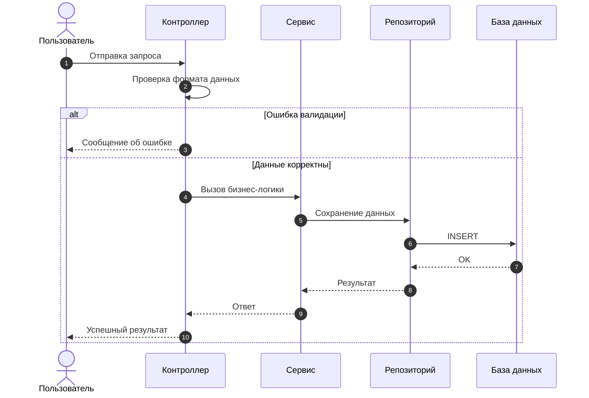
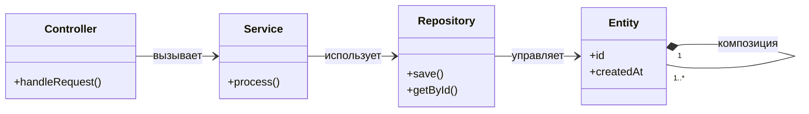

# Лабораторная работа №5 - Создание диаграммы последовательности и классов

## **1. Теория**

## **1.0. Цель работы**

Целью лабораторной работы является изучение и практическое освоение **диаграммы последовательности** и **диаграммы классов UML**, а также формирование навыков:

* моделирования поведения информационной системы во времени;
* описания взаимодействия компонентов и объектов системы;
* построения статической структуры программного обеспечения;
* установления соответствия между функциональными сценариями и архитектурными решениями;
* подготовки UML-моделей, используемых при проектировании и документировании ИС.

### **1.1. Общая роль UML-диаграмм в проектировании информационных систем**

**UML (Unified Modeling Language)** — это унифицированный язык визуального моделирования, применяемый для описания, анализа, проектирования и документирования программных и информационных систем.

UML-диаграммы позволяют:

* формализовать требования заказчика;
* снизить неоднозначность трактовки функциональности системы;
* обеспечить единое понимание системы между аналитиками, разработчиками и заказчиком;
* служить основой для архитектурных и проектных решений;
* упростить сопровождение и развитие программного продукта.

В UML различают **поведенческие** и **структурные** диаграммы.
В рамках данной лабораторной работы рассматриваются:

* **диаграмма последовательности** — поведенческая диаграмма;
* **диаграмма классов** — структурная диаграмма.

Их совместное использование позволяет получить целостное представление о системе: *как она работает* и *из чего она состоит*.

### **1.2. Диаграмма последовательности (Sequence Diagram)**

Диаграмма последовательности используется для **описания сценариев взаимодействия объектов и участников системы во времени**.

Она наглядно показывает:

* порядок выполнения операций;
* обмен сообщениями между компонентами;
* точки принятия решений;
* обработку альтернативных и ошибочных ситуаций.

Диаграмма последовательности строится для **конкретного сценария** (например, «Создание заявки», «Расчёт показателей», «Авторизация пользователя»).

#### **1.2.1. Назначение диаграммы последовательности**

Диаграмма последовательности предназначена для:

* детализации вариантов использования;
* распределения ответственности между компонентами системы;
* выявления необходимых операций и интерфейсов;
* анализа бизнес-логики и потоков данных;
* подготовки к реализации API и сервисных методов.

Она отвечает на вопросы:

* кто инициирует сценарий;
* какие компоненты участвуют во взаимодействии;
* в каком порядке выполняются вызовы;
* какие альтернативы возможны при ошибках или отклонениях.

#### **1.2.2. Основные элементы диаграммы последовательности**

##### **Актор (Actor)**

**Актор** — это пользователь или внешняя система, инициирующая взаимодействие с информационной системой.

Актор:

* не является частью системы;
* запускает сценарий;
* получает результат выполнения сценария.

##### **Участник (Participant)**

**Участник** — это объект или компонент системы, участвующий во взаимодействии (контроллер, сервис, репозиторий и т. д.).

##### **Линия жизни (Lifeline)**

Линия жизни отображает период существования участника во времени в рамках сценария.

##### **Сообщение (Message)**

Сообщение представляет собой вызов метода или передачу данных между участниками.

Различают:

* синхронные вызовы;
* возврат результата;
* сообщения ошибок.

##### **Комбинированные фрагменты**

Используются для описания логики:

* `alt` — альтернативные ветви (если / иначе);
* `opt` — опциональное действие;
* `loop` — повторяющийся фрагмент.

#### **1.2.3. Пример диаграммы последовательности**

/// caption
Рисунок 1 – Диаграмма последовательности выполнения сценария
///

### **1.3. Диаграмма классов (Class Diagram)**

**Диаграмма классов** предназначена для описания **структуры информационной системы**, её классов, атрибутов, методов и связей между ними.

Она отражает статическое представление системы и используется как основа для объектно-ориентированной реализации.

#### **1.3.1. Назначение диаграммы классов**

Диаграмма классов применяется для:

* моделирования предметной области;
* определения структуры данных;
* проектирования классов и интерфейсов;
* анализа связей между сущностями;
* документирования архитектурных решений.

Диаграмма классов отвечает на вопросы:

* какие классы существуют в системе;
* какие данные они хранят;
* какие операции выполняют;
* как классы связаны между собой.

#### **1.3.2. Структура класса**

Класс на диаграмме обычно содержит:

1. **Имя класса**
2. **Атрибуты** — характеристики объекта
3. **Методы** — операции, которые объект может выполнять

Для указания области видимости используются обозначения:

* `+` — public;
* `-` — private;
* `#` — protected.

#### **1.3.3. Основные типы связей между классами**

* **Ассоциация** — логическая связь между объектами;
* **Агрегация** — отношение «имеет», слабое владение;
* **Композиция** — отношение «состоит из», сильное владение;
* **Наследование** — отношение «является»;
* **Зависимость** — временное использование одного класса другим.

Также указывается **кратность** связей (`1`, `0..1`, `1..*`, `0..*`).

#### **1.3.4. Пример диаграммы классов**

/// caption
Рисунок 2 – Диаграмма классов информационной системы
///

### **1.4. Связь диаграммы последовательности и диаграммы классов**

Диаграммы последовательности и классов дополняют друг друга:

* диаграмма последовательности показывает **как** взаимодействуют объекты;
* диаграмма классов показывает **какие** объекты существуют и какие операции они поддерживают.

Методически корректный подход предполагает:

* сначала построение диаграмм последовательности на основе сценариев;
* затем формирование диаграммы классов по результатам анализа взаимодействий;
* проверку согласованности моделей.

### **1.5. Значение UML-диаграмм для проектирования ИС**

Использование диаграмм последовательности и классов позволяет:

* повысить качество проектных решений;
* снизить количество ошибок на этапе реализации;
* упростить командную разработку;
* обеспечить соответствие документации реальной архитектуре системы.

Данные диаграммы являются обязательным элементом проектной документации информационных систем и широко применяются в промышленной разработке и учебных проектах.

---

## **2. Задание**

### **2.0. Исходные данные (предметная область)**

Для выполнения лабораторной работы используется **информационная система по предметной области, закреплённой за студентом на семестр**.
Конкретный вариант предметной области и функциональных сценариев определяется индивидуальным заданием, опубликованным в **ЛМС**.

Предметная область должна быть согласована с ранее выполненными лабораторными работами.

### **2.1. Описание задания**

Необходимо выполнить **проектирование информационной системы с использованием UML**, построив:

1. **Диаграмму последовательности** для одного из ключевых сценариев работы системы.
2. **Диаграмму классов**, отражающую структуру системы и взаимосвязи между её элементами.

Диаграммы должны быть логически связаны между собой и соответствовать выбранному варианту предметной области.

В диаграмме последовательности требуется отразить:

* участников взаимодействия;
* порядок вызова операций;
* основную и альтернативные ветви выполнения сценария.

В диаграмме классов требуется отразить:

* классы системы;
* атрибуты и методы классов;
* связи между классами с указанием кратности.

### **2.2. Для выполнения требуется**

1. **Шаблон отчёта**, указанный в описании лабораторной работы.
2. **Вариант задания**, закреплённый за студентом на семестр и опубликованный в ЛМС.
3. **Требования к оформлению** — согласно методическим указаниям в ЛМС или соответствующему разделу документации.
4. Для построения диаграмм использовать **draw.io (diagrams.net)**.

Все диаграммы должны быть сохранены и вставлены в отчёт в виде изображений с подписями.

### **2.3. Запрет**

❗ **Запрещается использование систем искусственного интеллекта для выполнения лабораторной работы.**

Работы, выполненные с использованием ИИ, полностью или частично скопированные, а также не сданные, оцениваются в **0 баллов** без возможности доработки.

---

### **3. Контрольные вопросы**

1. В чём отличие диаграммы последовательности от диаграммы классов?
2. Какие задачи решает диаграмма последовательности при проектировании ИС?
3. Что такое линия жизни и фокус управления на диаграмме последовательности?
4. Для чего используются комбинированные фрагменты `alt`, `opt`, `loop`?
5. Какие элементы обязательно должны присутствовать на диаграмме классов?
6. Чем отличается ассоциация от композиции и агрегации?
7. Зачем указывать кратность связей между классами?
8. Как диаграммы последовательности влияют на формирование диаграммы классов?
9. Почему диаграмма классов считается структурной UML-диаграммой?
10. Какие типичные ошибки допускаются при построении UML-диаграмм?

---

### **4. Чек-лист оценки выполнения**

|   Баллы | Критерии оценки                                                                                                                                                                                                                                         |
| ------: | ------------------------------------------------------------------------------------------------------------------------------------------------------------------------------------------------------------------------------------------------------- |
|   **5** | Построены диаграмма последовательности и диаграмма классов; диаграммы логически связаны; корректно отражены сценарии, классы, методы, связи и кратности; оформление полностью соответствует требованиям; предметная область раскрыта полно и корректно. |
|   **4** | Обе диаграммы представлены, но имеются незначительные неточности (частично отсутствуют альтернативные ветви, не полностью указаны методы или кратности).                                                                                                |
|   **3** | Диаграммы построены формально; логическая связь между ними выражена слабо; допущены ошибки в обозначениях или структуре.                                                                                                                                |
| **1–2** | Представлена только одна диаграмма или обе диаграммы содержат существенные методические и логические ошибки.                                                                                                                                            |
|   **0** | **Работа скопирована, выполнена с помощью ИИ, либо не сдана.**                                                                                                                                                                                          |

--- 

## **5. Ссылка на скачивание шаблона отчета**

👉 [Скачать шаблон отчёта](assets/tempales//LR5.docx)