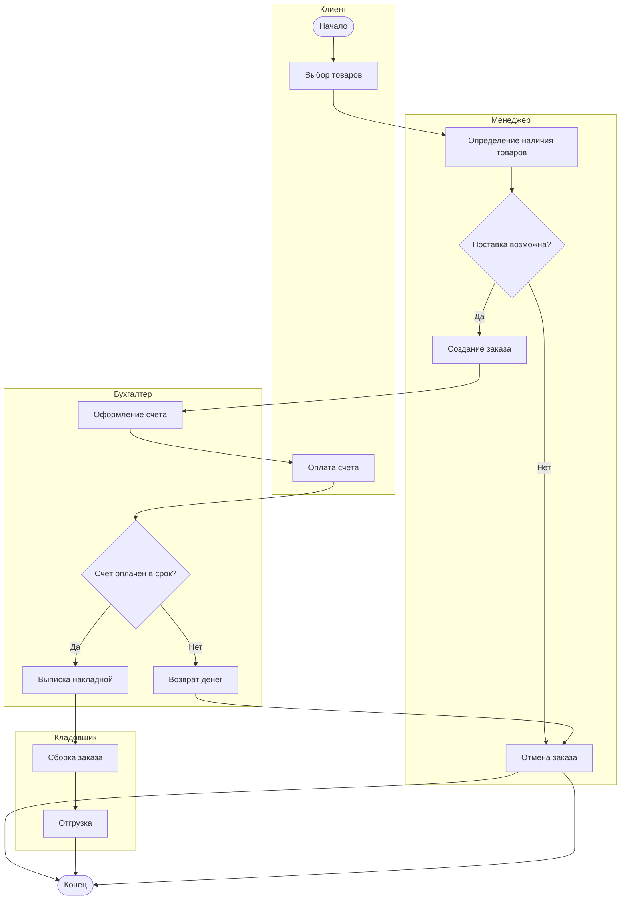
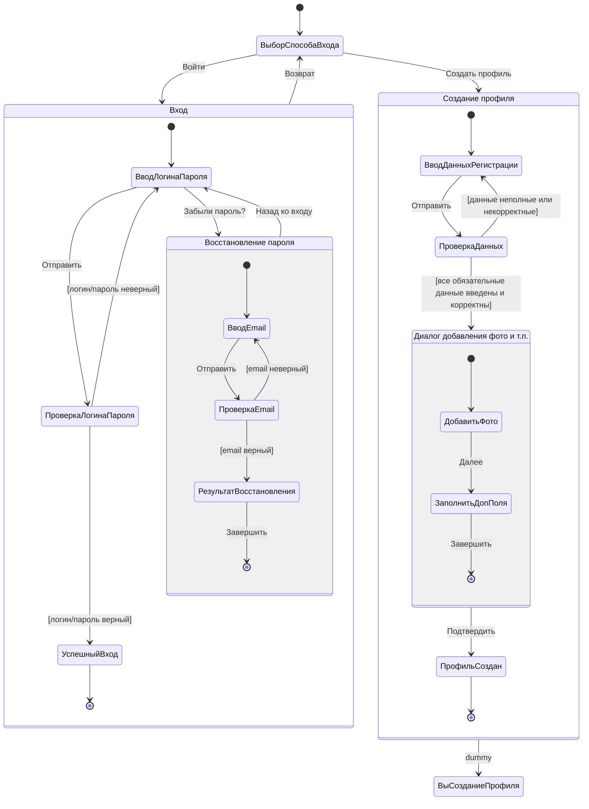

# Лабораторная работа №6 - Создание диаграммы деятельности и диаграммы состояний

## **1. Теория**

## **1.0. Цель работы**

Целью лабораторной работы является изучение и практическое освоение **диаграммы деятельности** и **диаграммы состояний UML**, а также формирование навыков:

* моделирования бизнес-процессов и алгоритмов работы информационной системы;
* описания логики выполнения действий и переходов между ними;
* анализа состояний объектов и условий их изменения;
* формализации динамического поведения системы на разных уровнях абстракции;
* использования UML-диаграмм при проектировании и документировании информационных систем.

### **1.1. Общая роль UML-диаграмм в проектировании информационных систем**

**UML (Unified Modeling Language)** — это унифицированный язык визуального моделирования, применяемый для описания, анализа, проектирования и документирования программных и информационных систем.

UML-диаграммы позволяют:

* формализовать требования к системе;
* представить логику работы системы в наглядном виде;
* выявить ошибки проектирования на ранних этапах;
* обеспечить единое понимание процессов между аналитиками, разработчиками и заказчиком;
* использовать модели как основу для реализации и сопровождения системы.

В UML выделяют несколько групп диаграмм. В рамках данной лабораторной работы рассматриваются **поведенческие диаграммы**, описывающие динамику работы системы:

* **диаграмма деятельности**;
* **диаграмма состояний**.

Эти диаграммы фокусируются на *процессах* и *состояниях*, а не на структуре классов и компонентов.

### **1.2. Диаграмма деятельности (Activity Diagram)**

**Диаграмма деятельности** используется для **описания алгоритмов, бизнес-процессов и потоков управления** в информационной системе.

Она отражает последовательность выполняемых действий, условия переходов и возможное параллельное выполнение операций.

Диаграмма деятельности наглядно показывает:

* какие действия выполняются в системе;
* в каком порядке они происходят;
* при каких условиях выполняются альтернативные ветви;
* какие действия могут выполняться параллельно.

Диаграмма деятельности применяется как для описания логики отдельных функций, так и для моделирования бизнес-процессов целиком.

#### **1.2.1. Назначение диаграммы деятельности**

Диаграмма деятельности предназначена для:

* моделирования бизнес-процессов предметной области;
* описания алгоритмов работы системы;
* детализации вариантов использования;
* анализа потоков управления и данных;
* выявления узких мест и логических ошибок в процессах.

Она отвечает на вопросы:

* какие шаги выполняет система;
* в какой последовательности они выполняются;
* какие условия влияют на ход выполнения;
* где возможны альтернативные пути выполнения.

Диаграмма деятельности отражает **процессный взгляд на систему**.
 
#### **1.2.2. Основные элементы диаграммы деятельности**

##### **Начальное состояние (Initial Node)**

Начальное состояние обозначает точку старта выполнения процесса.

##### **Действие (Action)**

**Действие** — это элементарный шаг алгоритма или бизнес-процесса, выполняемый системой.

##### **Поток управления (Control Flow)**

Поток управления показывает направление перехода от одного действия к другому.

##### **Условие (Decision / Merge)**

Используется для ветвления процесса в зависимости от логического условия.

##### **Параллельное выполнение (Fork / Join)**

Позволяет моделировать одновременное выполнение нескольких действий.

##### **Конечное состояние (Final Node)**

Обозначает завершение выполнения процесса.

### **1.2.3. Пример диаграммы деятельности (Activity Diagram)**

Рассмотрим пример процесса **обработка заказов в информационной системе**.

Диаграмма отражает:

* ролей (клиент, менеджер, бухгалтер, кладовщик);
* условий оплаты и сроков;
* возврата денег;
* отмены заказа;
* корректного завершения процесса.

/// caption
Рисунок 1 – Диаграмма деятельности: процесс обработки заказа
///

### **1.3. Диаграмма состояний (State Diagram)**

**Диаграмма состояний** предназначена для **описания жизненного цикла объекта** и изменения его состояния в результате событий.

Она фокусируется не на действиях системы, а на том, **в каких состояниях может находиться объект и как он переходит из одного состояния в другое**.

Диаграмма состояний применяется для объектов, поведение которых существенно зависит от их текущего состояния (заявка, заказ, пользователь, документ).

#### **1.3.1. Назначение диаграммы состояний**

Диаграмма состояний используется для:

* моделирования жизненного цикла сущностей;
* описания допустимых состояний объекта;
* определения событий, вызывающих переходы между состояниями;
* анализа корректности переходов и ограничений;
* предотвращения логических ошибок в управлении состояниями.

Она отвечает на вопросы:

* в каких состояниях может находиться объект;
* какие события приводят к изменению состояния;
* какие переходы разрешены, а какие запрещены.

Диаграмма состояний отражает **событийный и состоянийный взгляд на систему**.

#### **1.3.2. Основные элементы диаграммы состояний**

##### **Состояние (State)**

**Состояние** — это устойчивое положение объекта, в котором он обладает определёнными свойствами и поведением.

##### **Событие (Event)**

Событие инициирует переход объекта из одного состояния в другое.

##### **Переход (Transition)**

Переход показывает изменение состояния объекта при наступлении события и выполнении условия.

##### **Начальное состояние**

Обозначает состояние, в котором объект создаётся.

##### **Конечное состояние**

Отражает завершение жизненного цикла объекта.

### **1.3.3. Пример диаграммы состояний (State Diagram)**

Рассмотрим пример создание профиля.

Диаграмма отражает:

* начальное состояние и возвраты;
* вложенные (композитные) состояния «Вход» и «Создание профиля»;
* проверки корректности (guard-условия);
* финал сценария для успешного входа/регистрации.

/// caption
Рисунок 2 – Диаграмма состояний: жизненный цикл заявки
///

### **1.4. Сравнение диаграммы деятельности и диаграммы состояний**

Диаграммы деятельности и состояний решают разные, но взаимосвязанные задачи:

* диаграмма деятельности описывает **процесс выполнения действий**;
* диаграмма состояний описывает **изменение состояний объекта**.

Диаграмма деятельности применяется для моделирования алгоритмов и бизнес-процессов, а диаграмма состояний — для анализа поведения конкретных сущностей системы.

Совместное использование этих диаграмм позволяет глубже понять динамику работы информационной системы.

### **1.5. Значение диаграмм деятельности и состояний в проектировании ИС**

Использование диаграмм деятельности и состояний позволяет:

* повысить наглядность и формализованность описания процессов;
* выявить ошибки логики до этапа реализации;
* упростить коммуникацию между участниками проекта;
* обеспечить соответствие реализации требованиям предметной области.

Данные UML-диаграммы являются важным инструментом проектирования и широко применяются как в учебных, так и в промышленных информационных системах.

---

## **2. Задание**

### **2.0. Исходные данные (предметная область)**

Для выполнения лабораторной работы используется **информационная система по предметной области, закреплённой за студентом на семестр**.
Конкретный вариант предметной области и функциональных сценариев определяется индивидуальным заданием, опубликованным в **ЛМС**.

Предметная область должна быть согласована с ранее выполненными лабораторными работами. 

### **2.1. Описание задания**

Необходимо выполнить моделирование динамического поведения информационной системы с использованием **UML-диаграммы деятельности** и **UML-диаграммы состояний**.

В рамках задания требуется:

1. Выбрать **один ключевой процесс** информационной системы
   (например: оформление заказа, вход и регистрация пользователя, обработка заявки, выполнение расчёта, согласование документа).
2. Построить **диаграмму деятельности**, отражающую:

    - последовательность действий;
    - условия ветвления;
    - альтернативные сценарии;
    - возможное параллельное выполнение действий;
    - начало и завершение процесса.

3. Выбрать **одну ключевую сущность системы**
   (например: пользователь, заявка, заказ, проект, расчёт).
4. Построить **диаграмму состояний**, отражающую:

    - возможные состояния объекта;
    - события, вызывающие переходы между состояниями;
    - допустимые и недопустимые переходы;
    - начальное и конечное состояния.

Диаграммы должны быть **логически связаны** между собой и соответствовать выбранной предметной области.

---

### **2.2. Для выполнения требуется**

1. **Шаблон отчёта**, указанный в описании лабораторной работы.
2. **Вариант задания**, закреплённый за студентом на семестр и опубликованный в ЛМС.
3. **Требования к оформлению** — согласно методическим указаниям в ЛМС или соответствующему разделу документации.
4. Для построения диаграмм использовать **draw.io (diagrams.net)**.

Все диаграммы должны быть:

* выполнены в UML-нотации;
* сохранены в виде изображений;
* вставлены в отчёт с подписями вида
  *«Рисунок X – Диаграмма деятельности …»*,
  *«Рисунок Y – Диаграмма состояний …»*.

---

### **2.3. Запрет**

❗ **Запрещается использование систем искусственного интеллекта для выполнения лабораторной работы.**

Работы, выполненные с использованием ИИ, полностью или частично скопированные, а также не сданные, оцениваются в **0 баллов** без возможности доработки.

---

## **3. Контрольные вопросы**

1. В чём основное назначение диаграммы деятельности?
2. Чем диаграмма деятельности отличается от диаграммы последовательности?
3. Какие элементы обязательно присутствуют на диаграмме деятельности?
4. Для чего используются узлы ветвления и слияния?
5. В каких случаях целесообразно использовать параллельные ветви (fork/join)?
6. Что моделирует диаграмма состояний?
7. Чем состояние отличается от действия?
8. Что такое событие и переход на диаграмме состояний?
9. Почему диаграмма состояний особенно важна для сущностей с жизненным циклом?
10. Как связаны диаграмма деятельности и диаграмма состояний в рамках одного проекта?

---

## **4. Чек-лист для самопроверки**

|   Баллы | Критерии выполнения                                                                                                                                                                                                     |
| ------: | ----------------------------------------------------------------------------------------------------------------------------------------------------------------------------------------------------------------------- |
|   **5** | Построены диаграмма деятельности и диаграмма состояний; диаграммы логически связаны; корректно отражены действия, состояния, условия и переходы; соблюдена UML-нотация; оформление полностью соответствует требованиям. |
|   **4** | Обе диаграммы представлены, но допущены незначительные логические или методические неточности (частично отсутствуют альтернативные ветви, не полностью раскрыты состояния).                                             |
|   **3** | Диаграммы построены формально; логическая связь между процессом и состояниями выражена слабо; имеются ошибки в обозначениях.                                                                                            |
| **1–2** | Представлена только одна диаграмма или обе диаграммы содержат существенные ошибки, нарушающие логику предметной области.                                                                                                |
|   **0** | **Работа скопирована, выполнена с помощью ИИ, либо не сдана.**                                                                                                                                                          |

---

## **5. Ссылка на скачивание шаблона отчета**

👉 [Скачать шаблон отчёта](assets/tempales//LR6.docx)