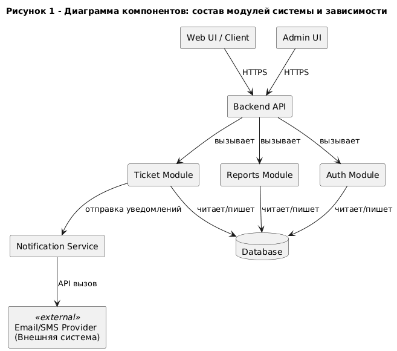
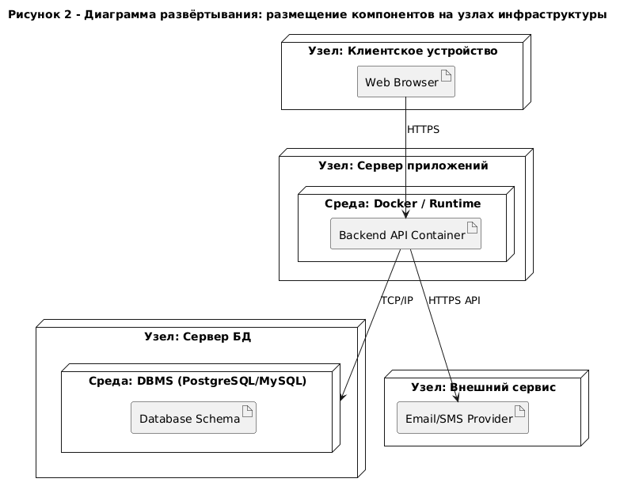

# Лабораторная работа №7 - Создание диаграммы компонентов и диаграммы развёртывания

## **1. Теория**

## **1.0. Цель работы**

Целью лабораторной работы является изучение и практическое освоение **диаграммы компонентов** и **диаграммы развёртывания UML**, а также формирование навыков:

* проектирования архитектуры программного обеспечения;
* выделения программных компонентов и определения их ответственности;
* описания связей и зависимостей между компонентами системы;
* моделирования физического размещения программных компонентов на вычислительных узлах;
* документирования архитектурных и инфраструктурных решений информационных систем.

### **1.1. Общая роль UML-диаграмм в проектировании информационных систем**

**UML (Unified Modeling Language)** — это унифицированный язык визуального моделирования, применяемый для описания, анализа, проектирования и документирования программных и информационных систем.

UML-диаграммы позволяют:

* формализовать архитектурные решения;
* обеспечить наглядное представление структуры и развертывания системы;
* выявить архитектурные риски и узкие места;
* согласовать программную и аппаратную архитектуру;
* упростить сопровождение и масштабирование системы.

В UML различают **поведенческие** и **структурные** диаграммы.
В рамках данной лабораторной работы рассматриваются **структурные UML-диаграммы**:

* **диаграмма компонентов**;
* **диаграмма развёртывания**.

Эти диаграммы описывают архитектуру системы на логическом и физическом уровнях.

### **1.2. Диаграмма компонентов (Component Diagram)**

**Диаграмма компонентов** предназначена для **описания программной архитектуры информационной системы** и отражает её разбиение на отдельные компоненты.

Компонент представляет собой **логически завершённую и заменяемую часть системы**, реализующую определённую функциональность и взаимодействующую с другими компонентами через интерфейсы.

Диаграмма компонентов наглядно показывает:

* состав программных компонентов системы;
* зависимости между компонентами;
* используемые и предоставляемые интерфейсы;
* архитектурные слои и подсистемы.

#### **1.2.1. Назначение диаграммы компонентов**

Диаграмма компонентов используется для:

* проектирования архитектуры программного обеспечения;
* декомпозиции системы на модули;
* определения границ ответственности компонентов;
* анализа связности и зависимости модулей;
* документирования архитектурных решений.

Она отвечает на вопросы:

* из каких компонентов состоит система;
* какие функции реализует каждый компонент;
* какие компоненты зависят друг от друга;
* через какие интерфейсы осуществляется взаимодействие.

Диаграмма компонентов отражает **логический архитектурный уровень системы**.

#### **1.2.2. Основные элементы диаграммы компонентов**

##### **Компонент (Component)**

**Компонент** — это программный модуль, библиотека, сервис или подсистема, обладающая чётко определённым назначением.

Примеры компонентов:

* веб-интерфейс;
* API-сервис;
* модуль бизнес-логики;
* модуль работы с базой данных;
* сервис аутентификации.

##### **Интерфейс (Interface)**

Интерфейс определяет набор операций, которые компонент:

* **предоставляет** другим компонентам;
* **использует** для взаимодействия.

Использование интерфейсов снижает связанность компонентов и повышает гибкость архитектуры.

##### **Зависимость (Dependency)**

Зависимость показывает, что один компонент использует функциональность другого.

##### **Пакет (Package)**

Пакет применяется для группировки связанных компонентов по подсистемам или архитектурным слоям.

### **1.2.3. Пример диаграммы компонентов (Component Diagram)**

Рассмотрим абстрактную **информационную систему управления заявками (ServiceDesk/Service System)**.
На диаграмме показаны основные компоненты, их ответственность и зависимости: клиентское приложение обращается к API, API использует модуль аутентификации и модуль заявок, которые работают с базой данных и внешними сервисами уведомлений.

/// caption
Рисунок 1 – Диаграмма компонентов: состав модулей системы и зависимости
///

### **1.3. Диаграмма развёртывания (Deployment Diagram)**

**Диаграмма развёртывания** предназначена для **описания физической архитектуры информационной системы** и отражает размещение программных компонентов на вычислительных узлах.

Она показывает, **где именно и на каком оборудовании работает система**.

Диаграмма развёртывания наглядно отображает:

* серверы и устройства;
* исполняемые среды;
* размещение компонентов и сервисов;
* сетевые соединения между узлами.

#### **1.3.1. Назначение диаграммы развёртывания**

Диаграмма развёртывания используется для:

* проектирования инфраструктуры системы;
* описания серверной и клиентской архитектуры;
* анализа производительности и масштабируемости;
* планирования развертывания и эксплуатации;
* документирования DevOps- и IT-решений.

Она отвечает на вопросы:

* на каких узлах развёртывается система;
* какие компоненты где размещены;
* как узлы взаимодействуют между собой;
* какие технологии и среды выполнения используются.

Диаграмма развёртывания отражает **физический уровень архитектуры системы**.

#### **1.3.2. Основные элементы диаграммы развёртывания**

##### **Узел (Node)**

**Узел** — это физическое или виртуальное устройство, на котором развёртываются компоненты системы.

Примеры узлов:

* клиентский компьютер;
* веб-сервер;
* сервер приложений;
* сервер базы данных;
* облачная платформа.

##### **Артефакт (Artifact)**

Артефакт представляет собой физически развёртываемую единицу:

* исполняемый файл;
* контейнер;
* библиотеку;
* архив;
* образ виртуальной машины.

##### **Среда выполнения (Execution Environment)**

Среда выполнения указывает программную платформу, в которой исполняется компонент
(например, Docker, .NET Runtime, JVM).

##### **Соединение (Communication Path)**

Соединение показывает сетевое взаимодействие между узлами (HTTP, HTTPS, TCP/IP и др.).

### **1.3.3. Пример диаграммы развёртывания (Deployment Diagram)**

Диаграмма развёртывания показывает физическое размещение компонентов на узлах инфраструктуры.
В примере ниже система развёрнута в виде веб-клиента на рабочем месте пользователя, API на сервере приложений (или в контейнере), база данных на отдельном сервере, а уведомления отправляются через внешний провайдер.

/// caption
Рисунок 2 – Диаграмма развёртывания: размещение компонентов на узлах инфраструктуры
///

### **1.4. Связь диаграммы компонентов и диаграммы развёртывания**

Диаграммы компонентов и развёртывания описывают архитектуру системы на разных уровнях:

* диаграмма компонентов показывает **логическую структуру программного обеспечения**;
* диаграмма развёртывания показывает **физическое размещение этой структуры**.

Методически корректный подход предполагает:

1. Сначала проектирование архитектуры в виде диаграммы компонентов.
2. Затем отображение размещения компонентов на узлах в диаграмме развёртывания.
3. Проверку соответствия логической и физической архитектуры.

### **1.5. Значение диаграмм компонентов и развёртывания в проектировании ИС**

Использование диаграмм компонентов и развёртывания позволяет:

* повысить качество архитектурных решений;
* обеспечить масштабируемость и отказоустойчивость системы;
* упростить сопровождение и развитие ИС;
* обеспечить прозрачность взаимодействия программных и аппаратных компонентов;
* документировать архитектуру системы в соответствии с промышленными стандартами.

Данные диаграммы являются обязательной частью архитектурной документации информационных систем и широко применяются как в учебных, так и в промышленных проектах.

---

## **2. Задание**

### **2.0. Исходные данные (предметная область)**

Для выполнения лабораторной работы используется **информационная система по предметной области, закреплённой за студентом на семестр**.
Конкретный вариант предметной области и функциональных сценариев определяется индивидуальным заданием, опубликованным в **ЛМС**.

Предметная область должна быть согласована с ранее выполненными лабораторными работами. 

### **2.1. Описание задания**

Необходимо выполнить **архитектурное моделирование информационной системы** с использованием UML, построив:

1. **Диаграмму компонентов**, отражающую:

      * состав программных компонентов системы;
      * распределение функциональности между компонентами;
      * зависимости и взаимодействие компонентов;
      * логические архитектурные слои (UI, бизнес-логика, доступ к данным и др.).

2. **Диаграмму развёртывания**, отражающую:

      * физические и/или виртуальные узлы системы;
      * размещение программных компонентов на узлах;
      * используемые среды выполнения;
      * сетевые соединения между узлами.

Диаграммы должны быть **логически связаны** между собой:
каждый компонент, показанный на диаграмме компонентов, должен быть корректно размещён на диаграмме развёртывания.

### **2.2. Для выполнения требуется**

1. **Шаблон отчёта**, указанный в описании лабораторной работы.
2. **Вариант задания**, закреплённый за студентом на семестр и опубликованный в ЛМС.
3. **Требования к оформлению** — согласно методическим указаниям в ЛМС или соответствующему разделу документации.
4. Для построения диаграмм использовать **draw.io (diagrams.net)**.

Все диаграммы должны быть сохранены и вставлены в отчёт в виде изображений с подписями.

### **2.3. Запрет**

❗ **Запрещается использование систем искусственного интеллекта для выполнения лабораторной работы.**

Работы, выполненные с использованием ИИ, полностью или частично скопированные, а также не сданные, оцениваются в **0 баллов** без возможности доработки.

---

## **3. Контрольные вопросы**

1. Для чего предназначена диаграмма компонентов UML?
2. Что называется компонентом в UML и какие требования к нему предъявляются?
3. В чём отличие диаграммы компонентов от диаграммы классов?
4. Что такое интерфейс компонента и зачем он используется?
5. Какие виды зависимостей могут быть показаны на диаграмме компонентов?
6. Для чего используется диаграмма развёртывания?
7. Что такое узел (node) на диаграмме развёртывания?
8. Чем артефакт отличается от компонента?
9. Почему важно согласовывать диаграмму компонентов и диаграмму развёртывания?
10. Какие ошибки чаще всего допускаются при проектировании архитектуры ИС?

---

## **4. Чек-лист для самопроверки**

|   Баллы | Критерии выполнения                                                                                                                                                                                               |
| ------: | ----------------------------------------------------------------------------------------------------------------------------------------------------------------------------------------------------------------- |
|   **6** | Построены диаграмма компонентов и диаграмма развёртывания; диаграммы логически связаны; корректно выделены компоненты, узлы и зависимости; соблюдена UML-нотация; оформление полностью соответствует требованиям. |
|   **4-5** | Обе диаграммы представлены, но имеются незначительные неточности (частично не раскрыты зависимости, не полностью показаны среды выполнения).                                                                      |
|   **3** | Диаграммы построены формально; архитектурная логика выражена слабо; допущены методические ошибки.                                                                                                                 |
| **1–2** | Представлена только одна диаграмма или обе диаграммы содержат существенные архитектурные ошибки.                                                                                                                  |
|   **0** | **Работа скопирована, выполнена с помощью ИИ, либо не сдана.**                                                                                                                                                    |

---

## **5. Ссылка на скачивание шаблона отчета**

👉 [Скачать шаблон отчёта](assets/tempales//LR7.docx)