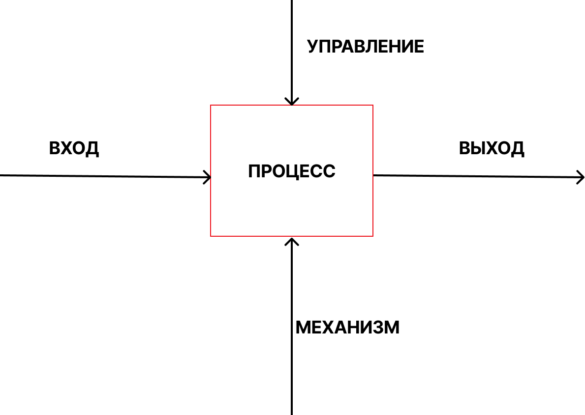
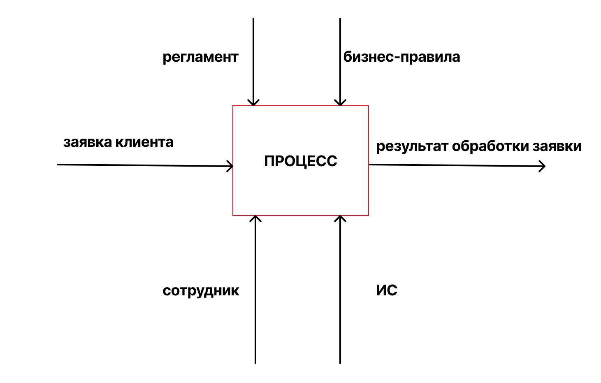
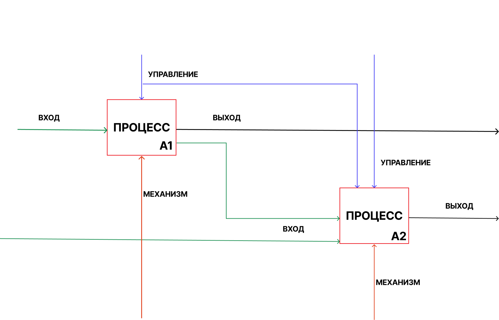
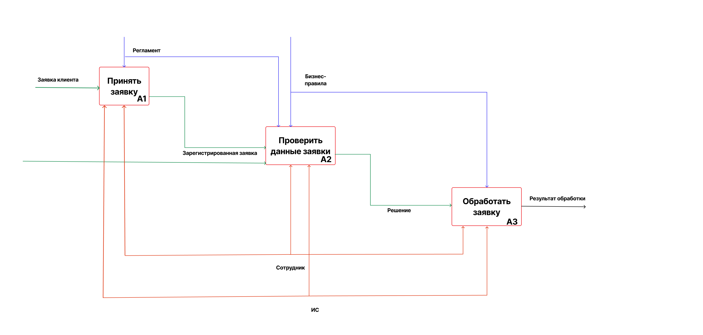

# Лабораторная работа №8 - Моделирование бизнес-процессов в нотации IDEF0

## **1. Теория**

## **1.0. Цель работы**

Целью лабораторной работы является изучение и практическое освоение **моделирования бизнес-процессов в нотации IDEF0**, а также формирование навыков:

* функционального анализа деятельности организации;
* декомпозиции бизнес-процессов;
* выделения входов, выходов, управляющих воздействий и механизмов;
* построения иерархии функциональных моделей;
* документирования бизнес-процессов информационных систем.

### **1.1. Общая роль моделирования бизнес-процессов**

Моделирование бизнес-процессов используется для **формального описания деятельности организации или информационной системы** с целью её анализа, оптимизации и автоматизации.

Модели бизнес-процессов позволяют:

* понять, **что делает система или организация**;
* выявить избыточные, дублирующиеся или неэффективные функции;
* определить границы автоматизации;
* обеспечить единое понимание процессов между заказчиком и разработчиком;
* использовать модель как основу для проектирования ИС.

Одной из классических и стандартизированных нотаций функционального моделирования является **IDEF0**.

### **1.2. Нотация IDEF0: общее представление**

**IDEF0 (Integration DEFinition for Function Modeling)** — это нотация функционального моделирования, предназначенная для **описания функций системы и связей между ними**.

IDEF0 отвечает на главный вопрос моделирования:

> **Что делает система и за счёт чего?**

В отличие от UML, IDEF0:

* не описывает порядок выполнения действий;
* не моделирует состояния или объекты;
* фокусируется на **функциях и потоках ресурсов**.

IDEF0 широко применяется при:

* обследовании предметной области;
* проектировании ИС;
* реинжиниринге бизнес-процессов;
* подготовке технических заданий.

### **1.3. Основные элементы нотации IDEF0**

Функция в IDEF0 изображается **прямоугольником**, а взаимодействие с ней — **стрелками**, которые строго классифицированы.

#### **1.3.1. Функция (Function)**

**Функция** — это деятельность, преобразующая входы в выходы.

Функция формулируется **глагольной фразой** (например:
«Обработать заявку», «Рассчитать показатели», «Оформить заказ»).

#### **1.3.2. Типы стрелок (ICOM)**

Каждая функция в IDEF0 имеет до четырёх типов связей:

* **Input (Вход)** — что преобразуется функцией
  (входит **слева**);
* **Control (Управление)** — правила, ограничения, регламенты
  (входит **сверху**);
* **Output (Выход)** — результат выполнения функции
  (выходит **справа**);
* **Mechanism (Механизм)** — ресурсы, исполнители, средства
  (входит **снизу**).

> Данная классификация известна как **ICOM-модель**.

### **1.4. Контекстная диаграмма IDEF0 (A-0)**

Моделирование в IDEF0 начинается с **контекстной диаграммы A-0**, которая описывает систему как **единую функцию** без детализации.

Контекстная диаграмма показывает:

* границы системы;
* основные входы и выходы;
* управляющие воздействия;
* механизмы выполнения.
 

/// caption
Рисунок 1 – ICOM
///

#### **1.4.1. Пример контекстной диаграммы (A-0)**

Рассмотрим информационную систему обработки заявок.
На контекстной диаграмме система представляется одной обобщённой функцией, без внутренней детализации.

/// caption
Рисунок 2 – Контекстная диаграмма IDEF0 (A-0): обработка заявки
///

Пояснение:

* Вход (Input): заявка клиента;
* Управление (Control): регламент, бизнес-правила;
* Механизм (Mechanism): сотрудник, информационная система;
* Выход (Output): результат обработки заявки.

### **1.5. Диаграмма верхнего уровня (A0)**

После построения контекстной диаграммы выполняется **декомпозиция функции A-0** на несколько подфункций, образующих диаграмму уровня **A0**.

Диаграмма A0:

* раскрывает структуру деятельности;
* показывает основные функциональные блоки;
* сохраняет согласованность с A-0 по входам, выходам, управлениям и механизмам.

/// caption
Рисунок 3 – Пример декомпозиции
///

#### **1.5.1. Пример диаграммы A0**
Функция A-0 «Обработать заявку» детализируется на основные подфункции.

Пояснение:
* A1 «Принять заявку» — регистрация и первичный ввод данных;
* A2 «Проверить данные заявки» — контроль корректности и полноты;
* A3 «Обработать заявку» — выполнение основной бизнес-логики;
* все подфункции используют единые управления и механизмы, согласованные с контекстной диаграммой.

/// caption
Рисунок 4 – Диаграмма IDEF0 уровня A0: декомпозиция процесса обработки заявки
///

### **1.6. Декомпозиция функций**

Каждый блок диаграммы A0 может быть **декомпозирован** далее (A1, A2, A3 и т. д.) до необходимого уровня детализации.

Правила декомпозиции:

* каждая функция раскрывается отдельной диаграммой;
* количество подфункций обычно от 3 до 6;
* сохраняется логическая целостность модели;
* все стрелки должны быть согласованы с родительской диаграммой.

#### **1.6.1. Пример декомпозиции функции**

Подфункция A1 «Принять заявку» может быть дополнительно детализирована.

##### **Диаграмма IDEF0 уровня A1 (детализация подфункции)**

###### **Назначение детализации уровня A1**

Диаграмма IDEF0 уровня **A1** предназначена для **детального раскрытия подфункции**, выделенной на диаграмме уровня **A0**.
Декомпозиция позволяет уточнить состав работ, выполняемых в рамках одной функции, без нарушения логики верхнего уровня.

В качестве примера рассмотрим подфункцию:

> **A1 – Принять заявку**

###### **Цель подфункции A1**

Целью подфункции **A1 «Принять заявку»** является получение обращения клиента, фиксация его в информационной системе и подготовка заявки к дальнейшей проверке и обработке.

###### **Состав подфункций уровня A1**

Подфункция **A1** декомпозируется на следующие процессы:

* **A1.1 Получить заявку**
* **A1.2 Проверить корректность ввода**
* **A1.3 Зарегистрировать заявку**

Количество подфункций соответствует рекомендуемым требованиям IDEF0 (3–6 блоков).

##### **Поэтапное описание подфункций уровня A1**

###### **A1.1 Получить заявку**

В рамках процесса выполняется:

* приём обращения клиента через доступный канал (веб-форма, почта, телефон);
* первичный сбор данных заявки;
* передача данных на проверку корректности.

###### **A1.2 Проверить корректность ввода**

Процесс включает:

* проверку заполнения обязательных полей;
* контроль форматов данных (контакты, текст, категории);
* выявление ошибок ввода;
* принятие решения о возможности регистрации заявки.

При обнаружении ошибок заявка возвращается на корректировку.

###### **A1.3 Зарегистрировать заявку**

В рамках процесса выполняется:

* сохранение заявки в информационной системе;
* присвоение уникального идентификатора;
* фиксация даты и времени регистрации;
* установка начального статуса заявки («Принята», «Зарегистрирована»);
* передача заявки на следующий уровень обработки (A2).

##### **Согласованность с родительской диаграммой**

Диаграмма уровня **A1** полностью согласуется с диаграммой **A0**:

* **Input** — данные заявки — соответствует выходу предыдущей функции;
* **Control** — регламент приёма — совпадает с управлением A1 на уровне A0;
* **Mechanism** — оператор и информационная система — сохранены без изменений;
* **Output** — зарегистрированная заявка — передаётся в процесс A2.

### **1.7. Отличие IDEF0 от UML-диаграмм**

IDEF0 и UML решают разные задачи:

* IDEF0 отвечает на вопрос **«что делает система?»**;
* UML отвечает на вопросы **«как система работает?»** и **«из чего она состоит?»**.

IDEF0 применяется на ранних этапах проектирования и хорошо сочетается с UML-диаграммами (Use Case, Activity, Class).

### **1.8. Значение IDEF0 в проектировании информационных систем**

Использование IDEF0 позволяет:

* формализовать деятельность предметной области;
* выявить требования к информационной системе;
* обосновать автоматизацию процессов;
* повысить качество технического задания;
* обеспечить прозрачность и логичность проектных решений.

Нотация IDEF0 является базовым инструментом функционального анализа и широко применяется при проектировании и внедрении информационных систем.

---

## **2. Задание**

### **2.0. Исходные данные (предметная область)**

Для выполнения лабораторной работы используется **информационная система по предметной области, закреплённой за студентом на семестр**.
Конкретный вариант предметной области и функциональных сценариев определяется индивидуальным заданием, опубликованным в **ЛМС**.

Предметная область должна быть согласована с ранее выполненными лабораторными работами. 

### **2.1. Описание задания**

Необходимо выполнить **функциональное моделирование бизнес-процессов информационной системы** с использованием нотации **IDEF0**.

В рамках задания требуется:

1. Определить **границы моделируемой системы** в соответствии с закреплённой предметной областью.
2. Построить **контекстную диаграмму IDEF0 (A-0)**, отражающую:

    * основную функцию системы;
    * входы (Input);
    * выходы (Output);
    * управляющие воздействия (Control);
    * механизмы выполнения (Mechanism).

3. Выполнить **декомпозицию контекстной диаграммы** и построить **диаграмму уровня A0**, содержащую:

    * основные подфункции процесса (3–6 блоков);
    * взаимосвязи между функциями;
    * согласованные входы, выходы, управления и механизмы.
4. При необходимости выполнить **декомпозицию одной из функций** (A1, A2 и т. д.) для более детального описания процесса.

Все диаграммы должны соответствовать правилам нотации IDEF0 и быть логически связаны между собой.

### **2.2. Для выполнения требуется**

1. **Шаблон отчёта**, указанный в описании лабораторной работы.
2. **Вариант задания**, закреплённый за студентом на семестр и опубликованный в ЛМС.
3. **Требования к оформлению** — согласно методическим указаниям в ЛМС или соответствующему разделу документации.
4. Для построения диаграмм использовать **draw.io (diagrams.net)**.

Все диаграммы должны быть:

* выполнены в нотации **IDEF0**;
* сохранены в виде изображений;
* вставлены в отчёт с подписями.

### **2.3. Запрет**

❗ **Запрещается использование систем искусственного интеллекта для выполнения лабораторной работы.**

Работы, выполненные с использованием ИИ, полностью или частично скопированные, а также не сданные, оцениваются в **0 баллов** без возможности доработки.

---

## **3. Контрольные вопросы**

1. Для чего используется моделирование бизнес-процессов?
2. Что такое нотация IDEF0 и какую задачу она решает?
3. В чём отличие IDEF0 от UML-диаграмм деятельности?
4. Что обозначает функция в IDEF0?
5. Какие типы стрелок используются в IDEF0 и каково их назначение?
6. Что такое ICOM-модель?
7. Какова роль контекстной диаграммы A-0?
8. Для чего выполняется декомпозиция диаграммы?
9. Какие требования предъявляются к количеству функций на диаграмме A0?
10. Почему важно сохранять согласованность стрелок между уровнями IDEF0?

---

## **4. Чек-лист для самопроверки**

|   Баллы | Критерии выполнения                                                                                                                                                                                                     |
| ------: | ----------------------------------------------------------------------------------------------------------------------------------------------------------------------------------------------------------------------- |
|   **8** | Построены контекстная диаграмма A-0 и диаграмма A0; корректно выделены входы, выходы, управления и механизмы; соблюдены правила IDEF0; диаграммы логически согласованы; оформление полностью соответствует требованиям. |
|   **5-7** | Диаграммы представлены, но имеются незначительные методические неточности (частично не раскрыты управления или механизмы).                                                                                              |
|   **3-4** | Модель построена формально; допущены ошибки в классификации стрелок или декомпозиции функций.                                                                                                                           |
| **1–2** | Представлена только одна диаграмма или допущены существенные ошибки в нотации IDEF0.                                                                                                                                    |
|   **0** | **Работа скопирована, выполнена с помощью ИИ, либо не сдана.**                                                                                                                                                          |

---

## **5. Ссылка на скачивание шаблона отчета**

👉 [Скачать шаблон отчёта](assets/tempales//LR8.docx)