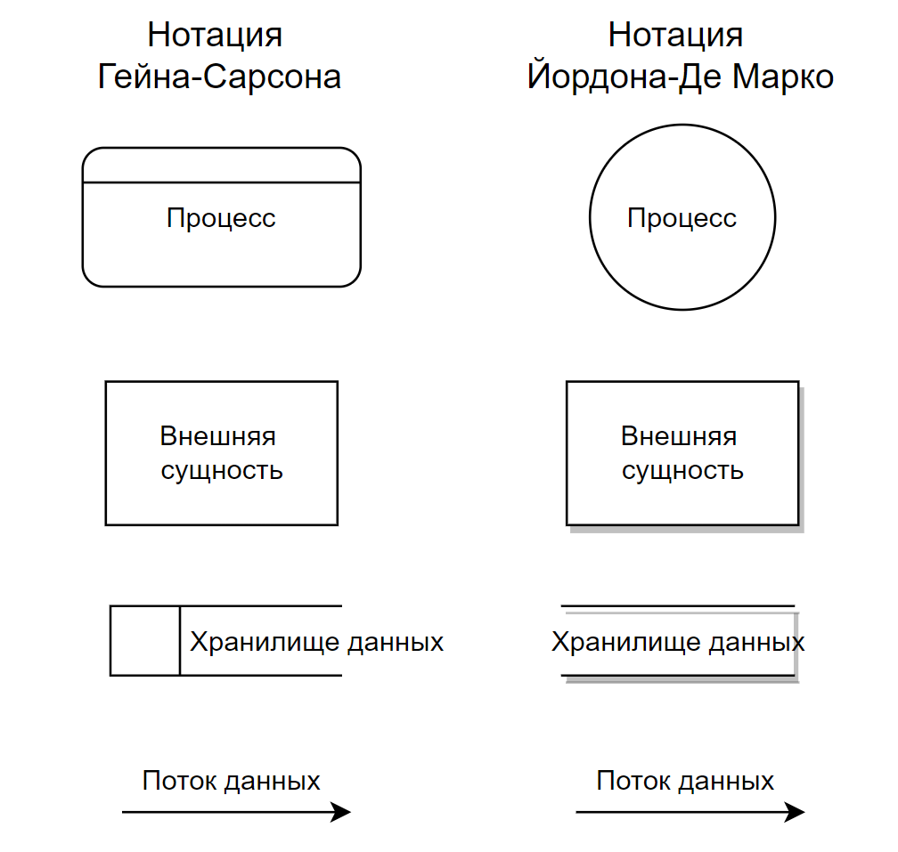
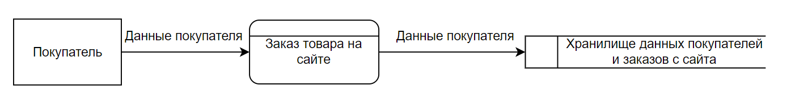
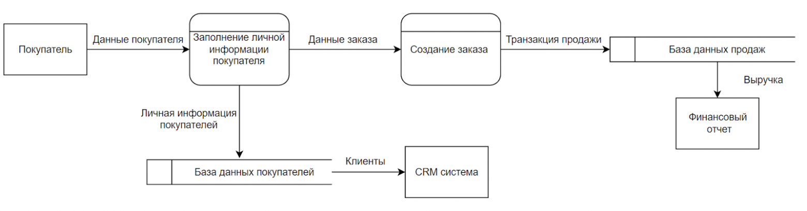
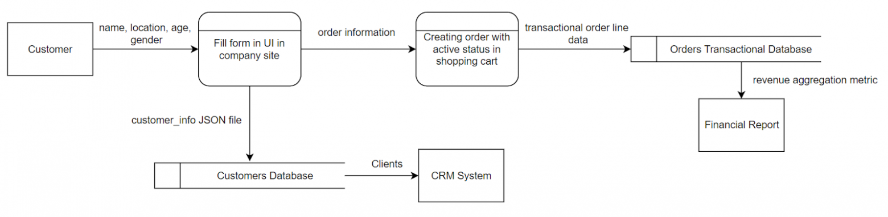

# Лабораторная работа №9 - Моделирование бизнес-процессов в нотации DFD

## **1. Теория**

## **1.0. Цель работы**

Целью лабораторной работы является изучение и практическое освоение **моделирования бизнес-процессов в нотации DFD (Data Flow Diagram)**, а также формирование навыков:

* анализа потоков данных в информационных системах;
* выделения процессов, источников и приёмников данных;
* определения хранилищ данных и их роли в системе;
* построения иерархии DFD-диаграмм (контекстной и декомпозированных);
* документирования логической модели обработки данных.

### **1.1. Общая роль моделирования потоков данных**

Моделирование потоков данных применяется для **описания того, как данные перемещаются, преобразуются и хранятся в информационной системе**.

DFD-модель позволяет:

* понять, **какие данные обрабатывает система**;
* определить источники и потребители информации;
* выявить избыточные или отсутствующие потоки данных;
* обеспечить корректное проектирование базы данных и API;
* служить основой для проектирования архитектуры ИС.

DFD широко используется на этапах **анализа требований и логического проектирования**.

### **1.2. Нотация DFD: общее представление**

**DFD (Data Flow Diagram)** — это нотация, предназначенная для **графического описания потоков данных между процессами, хранилищами и внешними сущностями**.

DFD отвечает на ключевые вопросы:

* какие данные поступают в систему;
* как данные обрабатываются;
* куда данные сохраняются;
* какие результаты выдаёт система.

В отличие от IDEF0, DFD:

* акцентирует внимание **на данных**, а не на функциях;
* отражает **движение и преобразование информации**;
* используется для проектирования логической структуры ИС.

### **1.3. Основные элементы нотации DFD**

/// caption
Рисунок 1 – Основные элементы нотации DFD
///

#### **1.3.1. Процесс (Process)**

**Процесс** — это действие или функция, которая **преобразует входные данные в выходные**.

Характеристики процесса:

* обозначается кругом или скруглённым прямоугольником;
* имеет уникальный номер;
* формулируется глагольной фразой
  (например: «Обработать заявку», «Проверить данные»).

#### **1.3.2. Поток данных (Data Flow)**

**Поток данных** отображает передачу информации между элементами системы.

Поток данных:

* обозначается стрелкой;
* имеет осмысленное название (существительное);
* показывает *что именно передаётся*.

#### **1.3.3. Хранилище данных (Data Store)**

**Хранилище данных** — это место долговременного хранения информации.

Примеры:

* база данных;
* файл;
* таблица;
* журнал.

Хранилище изображается в виде открытого прямоугольника и **не обрабатывает данные самостоятельно**.

#### **1.3.4. Внешняя сущность (External Entity)**

**Внешняя сущность** — это источник или приёмник данных, находящийся **вне границ системы**.

В роли внешней сущности могут выступать:

* пользователь;
* внешняя информационная система;
* организация;
* сервис или API.

### **1.4. Контекстная диаграмма DFD (Level 0)**

Контекстная диаграмма DFD отображает систему как **один обобщённый процесс**, взаимодействующий с внешними сущностями.

Она используется для:

* определения границ системы;
* выявления основных потоков данных;
* согласования требований с заказчиком.

#### **1.4.1. Пример контекстной диаграммы DFD**

Рассмотрим **информационную систему заказ товаров**.

/// caption
Рисунок 1 – Контекстная DFD-диаграмма (уровень 0): заказ товаров
///

### **1.5. Диаграмма DFD уровня 1 (декомпозиция процесса)**

После построения контекстной диаграммы выполняется **декомпозиция процесса P0** на несколько подпроцессов.

Диаграмма уровня 1:

* раскрывает внутреннюю структуру системы;
* показывает взаимодействие процессов с хранилищами данных;
* уточняет потоки информации.

##### **Логический уровень**

Отображает логику преобразования данных в системе в каждом процессе, описывает. Видны входные, промежуточные, выходные данные в каждом процессе, который протекает от внешней сущности до хранилищ данных. Больше указывает на вопрос “Что включает в себя процесс потока и обмена данными со стороны бизнеса?”

/// caption
Рисунок 2 – Логический уровень
///

##### **Физический уровень**

Включают точное отображение хранилищ данных, названий сущностей данных. Диаграмма физического уровня должна отвечать на вопрос “Как будет реализован процесс передачи и потока данных?”

/// caption
Рисунок 3 – Физический уровень
///

Также часто в других источниках можно увидеть разделение уровней диаграммы на 0,1, 2, 3 и так далее, в зависимости от уровня детализации.

Если мы говорим про разработку нового решения, то важно понять “что мы имеем сейчас” (AS-IS) и “что мы желаем получить” (TO-BE). Другими словами, мы разделяем наше текущее состояние и желаемое состояние, которое мы хотим получить с помощью нашего решения. 

###### AS-IS 
Описываем текущую логическую диаграмму.

###### TO-BE 
Описываем желаемую логической диаграмму с новой логикой и требования от бизнеса. После этого из желаемой логической диаграммы описываем физическую с новым техническим решением. 

### **1.6. Правила построения DFD**

При построении DFD необходимо соблюдать следующие правила:

* процесс должен иметь **хотя бы один вход и один выход**;
* внешние сущности не взаимодействуют напрямую с хранилищами данных;
* хранилища не обмениваются данными напрямую друг с другом;
* потоки данных должны быть подписаны;
* декомпозиция должна сохранять согласованность потоков между уровнями.

### **1.7. Отличие DFD от IDEF0 и UML**

DFD отличается от других нотаций:

* **IDEF0** отвечает на вопрос *«что делает система?»*;
* **DFD** отвечает на вопрос *«какие данные и как обрабатываются?»*;
* **UML** описывает поведение, структуру и взаимодействие объектов.

DFD удобно применять совместно с IDEF0 и UML для комплексного анализа и проектирования ИС.

### **1.8. Значение DFD в проектировании информационных систем**

Использование DFD позволяет:

* формализовать обработку данных;
* выявить требования к базе данных;
* обеспечить корректное проектирование интерфейсов;
* снизить количество ошибок на этапе реализации;
* повысить качество проектной документации.

Нотация DFD является одним из базовых инструментов анализа бизнес-процессов и широко используется при разработке информационных систем.

---

## **2. Задание**

### **2.0. Исходные данные (предметная область)**

Для выполнения лабораторной работы используется **информационная система по предметной области, закреплённой за студентом на семестр**.
Конкретный вариант предметной области и функциональных сценариев определяется индивидуальным заданием, опубликованным в **ЛМС**.

Предметная область должна быть согласована с ранее выполненными лабораторными работами, включая:

  * анализ предметной области;
  * моделирование бизнес-процессов в нотации IDEF0;
  * диаграммы вариантов использования (Use Case);
  * другие UML-диаграммы, выполненные в рамках курса.

### **2.1. Описание задания**

Необходимо выполнить **моделирование бизнес-процессов информационной системы в нотации DFD**, отразив потоки данных между основными элементами системы.

В рамках задания требуется:

1. Определить **границы информационной системы** и перечень внешних сущностей.
2. Построить **контекстную DFD-диаграмму (уровень 0)**, отразив:

    * обобщённый процесс системы;
    * основные входные и выходные потоки данных;
    * взаимодействие с внешними сущностями.
    
3. Выполнить **декомпозицию контекстного процесса** и построить **DFD-диаграмму уровня 1**, на которой:

    * выделены основные процессы;
    * показаны хранилища данных;
    * отображены потоки данных между процессами, хранилищами и внешними сущностями.
4. Обеспечить **согласованность потоков данных** между уровнями диаграмм.

Диаграммы должны соответствовать правилам нотации DFD и логике выбранной предметной области.

### **2.2. Для выполнения требуется**

1. **Шаблон отчёта**, указанный в описании лабораторной работы.
2. **Вариант задания**, закреплённый за студентом на семестр и опубликованный в ЛМС.
3. **Требования к оформлению** — согласно методическим указаниям в ЛМС или соответствующему разделу документации.
4. Для построения диаграмм использовать **draw.io (diagrams.net)**.

Все диаграммы должны быть:

* выполнены в нотации **DFD**;
* сохранены в виде изображений;
* вставлены в отчёт с подписями.

### **2.3. Запрет**

❗ **Запрещается использование систем искусственного интеллекта для выполнения лабораторной работы.**

Работы, выполненные с использованием ИИ, полностью или частично скопированные, а также не сданные, оцениваются в **0 баллов** без возможности доработки.

---

## **3. Контрольные вопросы**

1. Для чего используется моделирование бизнес-процессов в нотации DFD?
2. Какие элементы являются основными в DFD-диаграммах?
3. В чём отличие процесса от хранилища данных в DFD?
4. Что отображает контекстная DFD-диаграмма (уровень 0)?
5. Зачем выполняется декомпозиция DFD-диаграммы?
6. Какие ограничения существуют на взаимодействие элементов DFD?
7. Почему потоки данных должны иметь осмысленные названия?
8. В чём отличие DFD от IDEF0?
9. Как DFD используется при проектировании базы данных?
10. Какие типичные ошибки допускаются при построении DFD-диаграмм?

---

## **4. Чек-лист для самопроверки**

|   Баллы | Критерии выполнения                                                                                                                                                                                                                  |
| : |  |
|   **8** | Построены контекстная DFD-диаграмма и диаграмма уровня 1; корректно определены процессы, хранилища и внешние сущности; все потоки данных подписаны; диаграммы логически согласованы; оформление полностью соответствует требованиям. |
|   **5-7** | Диаграммы представлены, но имеются незначительные неточности (частично не раскрыты потоки данных или взаимодействие с хранилищами).                                                                                                  |
|   **3-4** | Диаграммы построены формально; допущены методические ошибки в обозначениях или декомпозиции процессов.                                                                                                                               |
| **1–2** | Представлена только одна диаграмма или обе диаграммы содержат существенные логические ошибки.                                                                                                                                        |
|   **0** | **Работа скопирована, выполнена с помощью ИИ, либо не сдана.**                

---

## **5. Ссылка на скачивание шаблона отчета**

👉 [Скачать шаблон отчёта](assets/tempales//LR9.docx)